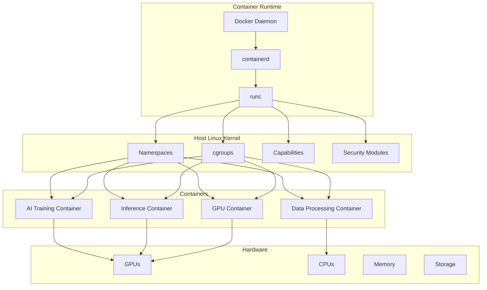
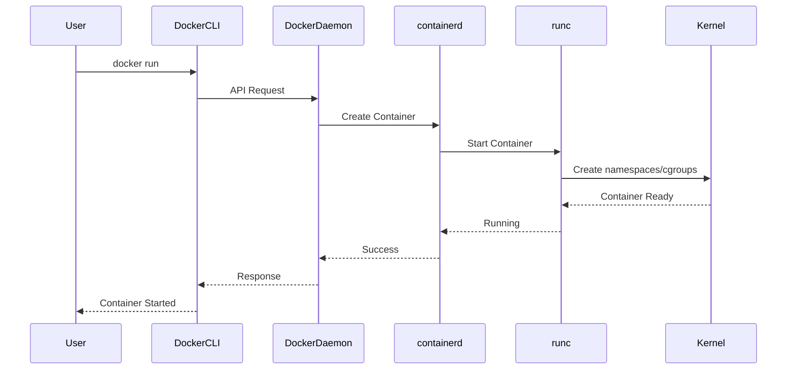

# Day 1: Linux + Containers

## Today's Learning Focus
- Linux fundamentals
- Docker & containers
- Namespaces & cgroups
- Container networking
- Image optimization
- GPU containers

---

## Overview: Linux and Containers as the Foundation of Modern AI Infrastructure

Linux and containers form the bedrock of modern AI infrastructure. Linux provides the kernel-level primitives (namespaces, cgroups, capabilities) that enable process isolation, resource control, and security. Containers leverage these primitives to package applications with their dependencies, ensuring consistency across development, testing, and production environments.

For AI workloads, containers enable:
- **Reproducibility**: Same environment across different machines
- **GPU isolation**: Multiple AI workloads sharing GPU resources
- **Scalability**: Easy horizontal scaling of inference services
- **Portability**: Deploy anywhere from local laptops to cloud clusters

---

## Architecture Diagram



---

## Docker Architecture

### Components

| Component | Description |
|-----------|-------------|
| **Docker Daemon** | Background service managing containers |
| **Docker Client** | CLI tool to interact with daemon |
| **Container Registry** | Storage for container images (Docker Hub, ECR, GCR) |
| **containerd** | Industry-standard container runtime |
| **runc** | Low-level runtime implementing OCI spec |

### Docker Architecture Flow



---

## Linux Process Isolation

### Namespaces

Linux namespaces isolate global system resources:

| Namespace Type | Isolation Scope | CLI Example |
|----------------|-----------------|-------------|
| `pid` | Process IDs | `--pid` |
| `net` | Network interfaces | `--network` |
| `mnt` | Mount points | `--volume` |
| `uts` | Hostname | `--hostname` |
| `ipc` | IPC resources | `--ipc` |
| `user` | User IDs | `--userns` |
| `cgroup` | Cgroup root | Auto-managed |

### cgroups (Control Groups)

cgroups limit and account for resource usage:

```bash
# Create a cgroup
sudo cgcreate -g cpu,memory:/ai_workload

# Set memory limit to 4GB
echo 4294967296 > /sys/fs/cgroup/memory/ai_workload/memory.limit_in_bytes

# Set CPU quota (50% of one core)
echo 50000 > /sys/fs/cgroup/cpu/ai_workload/cpu.cfs_quota_us
echo 100000 > /sys/fs/cgroup/cpu/ai_workload/cpu.cfs_period_us

# Run process in cgroup
cgexec -g cpu,memory:ai_workload python train.py
```

### Docker Resource Limits

```bash
docker run --rm \
  --memory=4g \
  --cpus=2.0 \
  --gpus all \
  nvidia/cuda:12.1.0-base-ubuntu22.04 \
  python train.py
```

---

## GPU Container Runtimes

### NVIDIA Container Toolkit Setup

```bash
# Add NVIDIA package repositories
distribution=$(. /etc/os-release;echo $ID$VERSION_ID)
curl -s -L https://nvidia.github.io/libnvidia-container/gpgkey | sudo apt-key add -
curl -s -L https://nvidia.github.io/libnvidia-container/$distribution/libnvidia-container.list | \
  sudo tee /etc/apt/sources.list.d/nvidia-container-toolkit.list

# Install NVIDIA Container Toolkit
sudo apt-get update
sudo apt-get install -y nvidia-container-toolkit

# Configure Docker
sudo nvidia-ctk runtime configure --runtime=docker
sudo systemctl restart docker

# Verify installation
docker run --rm --gpus all nvidia/cuda:12.1.0-base-ubuntu22.04 nvidia-smi
```

### Docker Compose with GPU Support

```yaml
version: '3.8'

services:
  ai-training:
    image: pytorch/pytorch:2.1.0-cuda12.1-cudnn8-runtime
    deploy:
      resources:
        reservations:
          devices:
            - driver: nvidia
              count: all
              capabilities: [gpu]
    volumes:
      - ./data:/data
      - ./models:/models
    environment:
      - NVIDIA_VISIBLE_DEVICES=all
      - CUDA_VISIBLE_DEVICES=0,1
    command: python train.py

  ai-inference:
    image: nvcr.io/nvidia/tritonserver:23.10-py3
    deploy:
      resources:
        reservations:
          devices:
            - driver: nvidia
              count: 1
              capabilities: [gpu]
    ports:
      - "8000:8000"
      - "8001:8001"
      - "8002:8002"
    volumes:
      - ./model-repository:/models
    command: tritonserver --model-repository=/models
```

---

## Container Debugging

### Common Debugging Commands

```bash
# Inspect container details
docker inspect <container_id>

# View container logs
docker logs -f <container_id>

# Execute command in running container
docker exec -it <container_id> bash

# Check resource usage
docker stats <container_id>

# View processes inside container
docker top <container_id>

# Copy files from container
docker cp <container_id>:/path/to/file ./local_path

# Network debugging
docker network ls
docker network inspect <network_name>
```

### Debugging GPU Containers

```bash
# Check GPU availability inside container
docker run --rm --gpus all nvidia/cuda:12.1.0-base-ubuntu22.04 \
  bash -c "nvidia-smi && nvcc --version"

# Test PyTorch GPU access
docker run --rm --gpus all pytorch/pytorch:2.1.0-cuda12.1-cudnn8-runtime \
  python -c "import torch; print(f'CUDA available: {torch.cuda.is_available()}')"

# Debug device mapping
docker run --rm --gpus '"device=0,1"' nvidia/cuda:12.1.0-base-ubuntu22.04 \
  bash -c "nvidia-smi -L"
```

---

## Production Optimization

### Image Optimization Strategies

```dockerfile
# Multi-stage build for optimized image
FROM nvidia/cuda:12.1.0-devel-ubuntu22.04 AS builder

WORKDIR /app
COPY requirements.txt .
RUN pip install --no-cache-dir -r requirements.txt

COPY . .
RUN python -m compileall .

# Runtime stage
FROM nvidia/cuda:12.1.0-runtime-ubuntu22.04

WORKDIR /app
COPY --from=builder /usr/local/lib/python3.10/site-packages /usr/local/lib/python3.10/site-packages
COPY --from=builder /app .

# Non-root user for security
RUN useradd -m -u 1000 appuser
USER appuser

CMD ["python", "inference.py"]
```

### Layer Caching Best Practices

```dockerfile
# Order layers by change frequency
FROM python:3.10-slim

# System dependencies (rarely change)
RUN apt-get update && apt-get install -y \
    libgl1-mesa-glx \
    libglib2.0-0 \
    && rm -rf /var/lib/apt/lists/*

# Python dependencies (change occasionally)
COPY requirements.txt .
RUN pip install --no-cache-dir -r requirements.txt

# Application code (changes frequently)
COPY . .

CMD ["python", "app.py"]
```

### BuildKit for Faster Builds

```bash
# Enable BuildKit
export DOCKER_BUILDKIT=1

# Build with cache mounts
docker build --progress=plain --secret id=pip,target=~/.pip/pip.conf .

# Use cache-from for CI/CD
docker build --cache-from=type=registry,ref=myrepo/myimage:latest .
```

---

## Container Security

### Security Best Practices

| Practice | Implementation | Impact |
|----------|---------------|--------|
| Non-root user | `USER appuser` | Prevents privilege escalation |
| Minimal base images | `alpine`, `slim` variants | Reduces attack surface |
| Read-only filesystem | `--read-only` flag | Prevents malicious writes |
| Drop capabilities | `--cap-drop ALL` | Minimizes kernel access |
| Secret management | Docker secrets, env vars | Protects sensitive data |
| Image scanning | Trivy, Clair | Detects vulnerabilities |

### Secure Docker Configuration

```bash
# Run with minimal privileges
docker run --rm \
  --read-only \
  --tmpfs /tmp \
  --cap-drop ALL \
  --cap-add NET_BIND_SERVICE \
  --security-opt no-new-privileges:true \
  --user 1000:1000 \
  my-ai-image

# Scan for vulnerabilities
trivy image my-ai-image:latest

# Use Docker Content Trust
export DOCKER_CONTENT_TRUST=1
docker pull my-ai-image:latest
```

### Docker Bench Security Script

```bash
# Run Docker security benchmark
docker run --rm \
  --net host \
  --pid host \
  --userns host \
  --cap-add audit_control \
  -v /var/lib/docker:/var/lib/docker:ro \
  -v /var/run/docker.sock:/var/run/docker.sock:ro \
  docker/docker-bench-security
```

---

## Real-world AI Container Workflows

### AI Training Workflow


### Complete Training Pipeline (Docker Compose)

```yaml
version: '3.8'

services:
  data-prep:
    image: python:3.10-slim
    volumes:
      - raw_data:/raw
      - processed_data:/processed
    command: |
      bash -c "
        pip install pandas numpy
        python /scripts/preprocess.py
      "

  training:
    image: pytorch/pytorch:2.1.0-cuda12.1-cudnn8-devel
    depends_on:
      - data-prep
    deploy:
      resources:
        reservations:
          devices:
            - driver: nvidia
              count: all
              capabilities: [gpu]
    volumes:
      - processed_data:/data
      - model_output:/models
      - ./training_script.py:/app/train.py
    working_dir: /app
    environment:
      - CUDA_VISIBLE_DEVICES=0,1,2,3
    command: python train.py --data-dir /data --output-dir /models

  evaluation:
    image: pytorch/pytorch:2.1.0-cuda12.1-cudnn8-runtime
    depends_on:
      - training
    volumes:
      - model_output:/models
      - test_data:/test
    command: python evaluate.py --model-dir /models --test-dir /test

  tensorboard:
    image: tensorflow/tensorflow:latest
    ports:
      - "6006:6006"
    volumes:
      - model_output:/logs
    command: tensorboard --logdir=/logs --host=0.0.0.0

volumes:
  raw_data:
  processed_data:
  model_output:
  test_data:
```

### Inference Service with Auto-scaling Hints

```yaml
version: '3.8'

services:
  inference-api:
    image: my-ai-inference:latest
    deploy:
      replicas: 3
      resources:
        reservations:
          devices:
            - driver: nvidia
              count: 1
              capabilities: [gpu]
        limits:
          memory: 8G
      restart_policy:
        condition: on-failure
        delay: 5s
        max_attempts: 3
    healthcheck:
      test: ["CMD", "curl", "-f", "http://localhost:8000/health"]
      interval: 30s
      timeout: 10s
      retries: 3
    environment:
      - MODEL_PATH=/models/latest
      - BATCH_SIZE=32
      - MAX_CONCURRENT_REQUESTS=100
    ports:
      - "8000:8000"
    volumes:
      - models:/models
    labels:
      - "traefik.enable=true"
      - "traefik.http.routers.inference.rule=PathPrefix(`/infer`)"

volumes:
  models:
```

---

## Troubleshooting

### Common Issues and Solutions

| Issue | Symptoms | Solution |
|-------|----------|----------|
| GPU not found | `CUDA_ERROR_NO_DEVICE` | Check NVIDIA toolkit installation, verify `--gpus all` flag |
| OOM errors | Container killed, exit code 137 | Increase memory limit, optimize batch size |
| Permission denied | `EACCES` errors | Use non-root user, fix volume permissions |
| Slow image pull | Long startup times | Use smaller base images, implement layer caching |
| Network timeouts | Connection refused | Check network mode, firewall rules |
| Model loading fails | File not found | Verify volume mounts, check paths |

### Diagnostic Commands

```bash
# Check Docker daemon status
systemctl status docker

# Verify NVIDIA runtime
docker info | grep -i runtime

# Check GPU utilization
watch -n 1 nvidia-smi

# Monitor container resources
docker stats --no-stream

# Inspect container events
docker events --since 1h

# Check disk usage
docker system df -v
```

---

## Best Practices Summary

### Development
- Use multi-stage builds to reduce image size
- Pin base image versions for reproducibility
- Implement proper logging and monitoring
- Use `.dockerignore` to exclude unnecessary files

### Production
- Implement health checks for all services
- Use read-only root filesystem where possible
- Regularly scan images for vulnerabilities
- Implement proper secret management
- Use resource limits to prevent resource exhaustion

### GPU Optimization
- Match CUDA versions across components
- Use mixed precision training when possible
- Implement gradient accumulation for large batches
- Monitor GPU memory fragmentation

### Cost Optimization
- Use spot instances for training workloads
- Implement model quantization for inference
- Right-size GPU allocation based on workload
- Use auto-scaling based on demand

---

## Scaling Strategies

### Horizontal Scaling

```bash
# Scale inference service
docker service scale inference-api=10

# Load balancing with Traefik
docker network create traefik-net

docker run -d \
  -p 80:80 \
  -p 443:443 \
  -v /var/run/docker.sock:/var/run/docker.sock \
  traefik:v2.10 \
  --api.dashboard=true \
  --providers.docker=true \
  --entrypoints.web.address=:80
```

### Vertical Scaling

```yaml
# Increase resources for demanding workloads
deploy:
  resources:
    reservations:
      devices:
        - driver: nvidia
          count: 4
          capabilities: [gpu]
    limits:
      memory: 32G
      cpus: '8.0'
```

---

## Additional Resources

- [Docker Documentation](https://docs.docker.com/)
- [NVIDIA Container Toolkit](https://docs.nvidia.com/datacenter/cloud-native/container-toolkit/)
- [Linux Namespaces Guide](https://lwn.net/Articles/531114/)
- [cgroups v2 Documentation](https://www.kernel.org/doc/html/latest/admin-guide/cgroup-v2.html)
- [Docker Security Best Practices](https://docs.docker.com/engine/security/)

---

*Generated as part of the 12-Day AI Infrastructure Learning Path*
