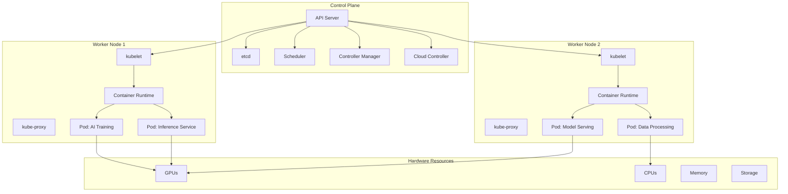
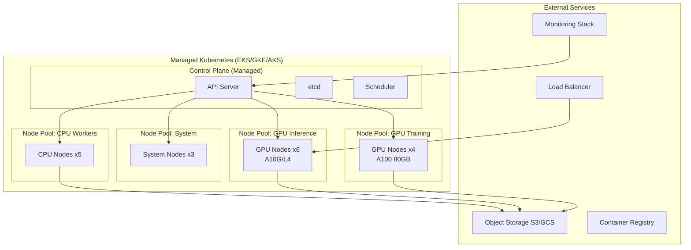

# Day 2: Kubernetes Fundamentals

## Today's Learning Focus
- Pods & Deployments
- Services & Ingress
- StatefulSets
- Helm Charts
- Autoscaling
- GPU scheduling basics
- Observability fundamentals

---

## Overview: Kubernetes as the Operating System for AI Infrastructure

Kubernetes has become the de facto operating system for AI infrastructure, providing:
- **Resource orchestration**: Automated scheduling of AI workloads across clusters
- **GPU management**: Fine-grained GPU allocation and sharing
- **Self-healing**: Automatic restart and rescheduling of failed workloads
- **Scaling**: Horizontal and vertical autoscaling based on demand
- **Service discovery**: Built-in networking for distributed AI systems
- **Declarative configuration**: Infrastructure as Code for reproducible deployments

For AI/ML workloads, Kubernetes enables production-grade deployment of training jobs, inference services, and data pipelines with enterprise-level reliability.

---

## Kubernetes Architecture



### Control Plane Components

| Component | Function | Port |
|-----------|----------|------|
| **API Server** | Central management endpoint | 6443 |
| **etcd** | Distributed key-value store | 2379-2380 |
| **Scheduler** | Pod placement decisions | 10259 |
| **Controller Manager** | Cluster state maintenance | 10257 |
| **Cloud Controller** | Cloud provider integration | Varies |

### Worker Node Components

| Component | Function |
|-----------|----------|
| **kubelet** | Node agent managing pods |
| **kube-proxy** | Network proxy for services |
| **Container Runtime** | Container execution (containerd, CRI-O) |
| **Pods** | Smallest deployable units |

---

## GPU Scheduling in Kubernetes

### NVIDIA Device Plugin Setup

```yaml
# nvidia-device-plugin.yml
apiVersion: apps/v1
kind: DaemonSet
metadata:
  name: nvidia-device-plugin-daemonset
  namespace: kube-system
spec:
  selector:
    matchLabels:
      name: nvidia-device-plugin-ds
  updateStrategy:
    type: RollingUpdate
  template:
    metadata:
      labels:
        name: nvidia-device-plugin-ds
    spec:
      tolerations:
        - key: nvidia.com/gpu
          operator: Exists
          effect: NoSchedule
      containers:
        - image: nvcr.io/nvidia/k8s-device-plugin:v0.14.1
          name: nvidia-device-plugin-ctr
          securityContext:
            allowPrivilegeEscalation: false
            capabilities:
              drop: ["ALL"]
          volumeMounts:
            - name: device-plugin
              mountPath: /var/lib/kubelet/device-plugins
      volumes:
        - name: device-plugin
          hostPath:
            path: /var/lib/kubelet/device-plugins
```

### GPU Resource Requests

```yaml
apiVersion: v1
kind: Pod
metadata:
  name: gpu-training-pod
spec:
  containers:
    - name: trainer
      image: pytorch/pytorch:2.1.0-cuda12.1-cudnn8-devel
      command: ["python", "train.py"]
      resources:
        limits:
          nvidia.com/gpu: 4
          memory: 32Gi
          cpu: "8"
        requests:
          nvidia.com/gpu: 4
          memory: 16Gi
          cpu: "4"
      volumeMounts:
        - name: model-storage
          mountPath: /models
  volumes:
    - name: model-storage
      persistentVolumeClaim:
        claimName: model-pvc
  nodeSelector:
    nvidia.com/gpu.present: "true"
```

### Multi-Instance GPU (MIG) Configuration

```yaml
apiVersion: v1
kind: Pod
metadata:
  name: mig-inference-pod
spec:
  containers:
    - name: inference
      image: nvcr.io/nvidia/tritonserver:23.10-py3
      resources:
        limits:
          nvidia.com/mig-3g.20gb: 1
        requests:
          nvidia.com/mig-3g.20gb: 1
```

---

## AI Workloads on Kubernetes

### Training Job with PyTorch Distributed

```yaml
apiVersion: batch/v1
kind: Job
metadata:
  name: pytorch-distributed-training
spec:
  ttlSecondsAfterFinished: 3600
  parallelism: 4
  completions: 4
  completionMode: Indexed
  template:
    spec:
      containers:
        - name: trainer
          image: pytorch/pytorch:2.1.0-cuda12.1-cudnn8-devel
          command:
            - torchrun
            - --nproc_per_node=1
            - --nnodes=4
            - --node_rank=$(POD_INDEX)
            - --master_addr=pytorch-master
            - --master_port=29500
            - train.py
          env:
            - name: POD_INDEX
              valueFrom:
                fieldRef:
                  fieldPath: metadata.annotations['batch.kubernetes.io/job-completion-index']
          resources:
            limits:
              nvidia.com/gpu: 1
              memory: 16Gi
          volumeMounts:
            - name: dataset
              mountPath: /data
            - name: checkpoints
              mountPath: /checkpoints
      volumes:
        - name: dataset
          persistentVolumeClaim:
            claimName: dataset-pvc
        - name: checkpoints
          persistentVolumeClaim:
            claimName: checkpoints-pvc
      restartPolicy: OnFailure
```

### Inference Service Deployment

```yaml
apiVersion: apps/v1
kind: Deployment
metadata:
  name: llm-inference-service
  labels:
    app: llm-inference
spec:
  replicas: 3
  selector:
    matchLabels:
      app: llm-inference
  template:
    metadata:
      labels:
        app: llm-inference
      annotations:
        prometheus.io/scrape: "true"
        prometheus.io/port: "8000"
    spec:
      containers:
        - name: vllm
          image: vllm/vllm-openai:latest
          args:
            - --model
            - meta-llama/Llama-2-7b-hf
            - --tensor-parallel-size
            - "2"
            - --max-num-seqs
            - "256"
          ports:
            - containerPort: 8000
              name: http
            - containerPort: 8001
              name: metrics
          resources:
            limits:
              nvidia.com/gpu: 2
              memory: 40Gi
            requests:
              nvidia.com/gpu: 2
              memory: 20Gi
          livenessProbe:
            httpGet:
              path: /health
              port: 8000
            initialDelaySeconds: 30
            periodSeconds: 10
          readinessProbe:
            httpGet:
              path: /ready
              port: 8000
            initialDelaySeconds: 5
            periodSeconds: 5
          env:
            - name: HUGGING_FACE_HUB_TOKEN
              valueFrom:
                secretKeyRef:
                  name: hf-secret
                  key: token
      affinity:
        podAntiAffinity:
          preferredDuringSchedulingIgnoredDuringExecution:
            - weight: 100
              podAffinityTerm:
                labelSelector:
                  matchLabels:
                    app: llm-inference
                topologyKey: kubernetes.io/hostname
```

---

## Services & Ingress

### Service Types for AI Workloads

```yaml
# ClusterIP for internal communication
apiVersion: v1
kind: Service
metadata:
  name: inference-internal
spec:
  selector:
    app: llm-inference
  ports:
    - port: 80
      targetPort: 8000
  type: ClusterIP

---
# LoadBalancer for external access
apiVersion: v1
kind: Service
metadata:
  name: inference-external
  annotations:
    service.beta.kubernetes.io/aws-load-balancer-type: "nlb"
spec:
  selector:
    app: llm-inference
  ports:
    - port: 80
      targetPort: 8000
  type: LoadBalancer

---
# Headless service for stateful workloads
apiVersion: v1
kind: Service
metadata:
  name: training-headless
spec:
  selector:
    app: pytorch-worker
  clusterIP: None
  ports:
    - port: 29500
      name: dist
```

### Ingress Configuration

```yaml
apiVersion: networking.k8s.io/v1
kind: Ingress
metadata:
  name: ai-platform-ingress
  annotations:
    nginx.ingress.kubernetes.io/ssl-redirect: "true"
    nginx.ingress.kubernetes.io/proxy-body-size: "100m"
    nginx.ingress.kubernetes.io/proxy-read-timeout: "300"
    cert-manager.io/cluster-issuer: "letsencrypt-prod"
spec:
  ingressClassName: nginx
  tls:
    - hosts:
        - api.ai-platform.example.com
      secretName: ai-platform-tls
  rules:
    - host: api.ai-platform.example.com
      http:
        paths:
          - path: /infer
            pathType: Prefix
            backend:
              service:
                name: inference-internal
                port:
                  number: 80
          - path: /train
            pathType: Prefix
            backend:
              service:
                name: training-controller
                port:
                  number: 8080
          - path: /metrics
            pathType: Prefix
            backend:
              service:
                name: prometheus
                port:
                  number: 9090
```

---

## StatefulSets for AI Databases

```yaml
apiVersion: apps/v1
kind: StatefulSet
metadata:
  name: vector-db
spec:
  serviceName: vector-db
  replicas: 3
  selector:
    matchLabels:
      app: vector-db
  template:
    metadata:
      labels:
        app: vector-db
    spec:
      containers:
        - name: qdrant
          image: qdrant/qdrant:v1.7.0
          ports:
            - containerPort: 6333
              name: http
            - containerPort: 6334
              name: grpc
          volumeMounts:
            - name: data
              mountPath: /qdrant/storage
          resources:
            requests:
              memory: 8Gi
              cpu: "2"
            limits:
              memory: 16Gi
              cpu: "4"
          livenessProbe:
            httpGet:
              path: /
              port: 6333
            initialDelaySeconds: 30
            periodSeconds: 10
  volumeClaimTemplates:
    - metadata:
        name: data
      spec:
        accessModes: ["ReadWriteOnce"]
        storageClassName: gp3
        resources:
          requests:
            storage: 100Gi
```

---

## Helm Charts for AI Deployments

### Chart Structure

```
ai-inference-chart/
├── Chart.yaml
├── values.yaml
├── values-production.yaml
├── templates/
│   ├── deployment.yaml
│   ├── service.yaml
│   ├── configmap.yaml
│   ├── secret.yaml
│   ├── hpa.yaml
│   └── ingress.yaml
└── charts/
```

### Chart.yaml

```yaml
apiVersion: v2
name: ai-inference
description: Helm chart for AI inference service
type: application
version: 1.0.0
appVersion: "1.0.0"
keywords:
  - ai
  - inference
  - llm
  - gpu
maintainers:
  - name: AI Platform Team
    email: ai-platform@example.com
```

### values.yaml

```yaml
replicaCount: 3

image:
  repository: vllm/vllm-openai
  tag: latest
  pullPolicy: IfNotPresent

modelName: meta-llama/Llama-2-7b-hf

resources:
  limits:
    nvidia.com/gpu: 1
    memory: 20Gi
  requests:
    nvidia.com/gpu: 1
    memory: 10Gi

autoscaling:
  enabled: true
  minReplicas: 2
  maxReplicas: 10
  targetCPUUtilizationPercentage: 70
  targetMemoryUtilizationPercentage: 80

service:
  type: ClusterIP
  port: 80

ingress:
  enabled: true
  className: nginx
  hosts:
    - host: infer.example.com
      paths:
        - path: /
          pathType: Prefix

huggingFaceSecret:
  create: true
  token: ""

prometheus:
  enabled: true
  scrapeInterval: 15s
```

### templates/deployment.yaml

```yaml
apiVersion: apps/v1
kind: Deployment
metadata:
  name: {{ include "ai-inference.fullname" . }}
  labels:
    {{- include "ai-inference.labels" . | nindent 4 }}
spec:
  replicas: {{ .Values.replicaCount }}
  selector:
    matchLabels:
      {{- include "ai-inference.selectorLabels" . | nindent 6 }}
  template:
    metadata:
      labels:
        {{- include "ai-inference.selectorLabels" . | nindent 8 }}
    spec:
      containers:
        - name: {{ .Chart.Name }}
          image: "{{ .Values.image.repository }}:{{ .Values.image.tag }}"
          imagePullPolicy: {{ .Values.image.pullPolicy }}
          args:
            - --model
            - {{ .Values.modelName }}
            - --tensor-parallel-size
            - "{{ index .Values.resources.limits \"nvidia.com/gpu\" }}"
          ports:
            - name: http
              containerPort: 8000
              protocol: TCP
          livenessProbe:
            httpGet:
              path: /health
              port: http
            initialDelaySeconds: 60
            periodSeconds: 10
          readinessProbe:
            httpGet:
              path: /ready
              port: http
            initialDelaySeconds: 10
            periodSeconds: 5
          resources:
            {{- toYaml .Values.resources | nindent 12 }}
          env:
            - name: HUGGING_FACE_HUB_TOKEN
              valueFrom:
                secretKeyRef:
                  name: {{ include "ai-inference.fullname" . }}-hf-secret
                  key: token
```

### Installation Commands

```bash
# Add Helm repositories
helm repo add nvidia https://helm.ngc.nvidia.com/nvidia
helm repo add prometheus-community https://prometheus-community.github.io/helm-charts

# Install with default values
helm install my-inference ./ai-inference-chart

# Install with production values
helm install my-inference ./ai-inference-chart -f values-production.yaml

# Upgrade existing deployment
helm upgrade my-inference ./ai-inference-chart --set replicaCount=5

# Rollback to previous version
helm rollback my-inference 1

# View release history
helm history my-inference
```

---

## Autoscaling Strategies

### Horizontal Pod Autoscaler (HPA)

```yaml
apiVersion: autoscaling/v2
kind: HorizontalPodAutoscaler
metadata:
  name: inference-hpa
spec:
  scaleTargetRef:
    apiVersion: apps/v1
    kind: Deployment
    name: llm-inference-service
  minReplicas: 2
  maxReplicas: 20
  metrics:
    - type: Resource
      resource:
        name: cpu
        target:
          type: Utilization
          averageUtilization: 70
    - type: Resource
      resource:
        name: memory
        target:
          type: Utilization
          averageUtilization: 80
    - type: Pods
      pods:
        metric:
          name: requests_per_second
        target:
          type: AverageValue
          averageValue: "100"
  behavior:
    scaleDown:
      stabilizationWindowSeconds: 300
      policies:
        - type: Percent
          value: 50
          periodSeconds: 60
    scaleUp:
      stabilizationWindowSeconds: 0
      policies:
        - type: Percent
          value: 100
          periodSeconds: 15
        - type: Pods
          value: 4
          periodSeconds: 15
      selectPolicy: Max
```

### Vertical Pod Autoscaler (VPA)

```yaml
apiVersion: autoscaling.k8s.io/v1
kind: VerticalPodAutoscaler
metadata:
  name: training-vpa
spec:
  targetRef:
    apiVersion: batch/v1
    kind: Job
    name: pytorch-training
  updatePolicy:
    updateMode: Auto
  resourcePolicy:
    containerPolicies:
      - containerName: trainer
        controlledResources: ["cpu", "memory"]
        minAllowed:
          cpu: 2
          memory: 8Gi
        maxAllowed:
          cpu: 16
          memory: 64Gi
```

### KEDA for Event-Driven Scaling

```yaml
apiVersion: keda.sh/v1alpha1
kind: ScaledObject
metadata:
  name: inference-scaledobject
spec:
  scaleTargetRef:
    name: llm-inference-service
  minReplicaCount: 1
  maxReplicaCount: 50
  cooldownPeriod: 300
  pollingInterval: 10
  triggers:
    - type: prometheus
      metadata:
        serverAddress: http://prometheus:9090
        metricName: inference_queue_depth
        query: sum(queue_depth{service="inference"})
        threshold: '10'
    - type: cpu
      metadata:
        type: Utilization
        value: '70'
```

---

## Production Cluster Setup

### Cluster Architecture



### Node Pool Configuration (EKS Example)

```yaml
# eks-cluster-config.yaml
apiVersion: eksctl.io/v1alpha5
kind: ClusterConfig

metadata:
  name: ai-platform-cluster
  region: us-west-2
  version: "1.28"

managedNodeGroups:
  - name: system-nodes
    instanceType: m5.2xlarge
    desiredCapacity: 3
    minSize: 3
    maxSize: 5
    volumeSize: 100
    labels:
      node-type: system
    taints:
      - key: workload
        value: system
        effect: NoSchedule

  - name: gpu-training
    instanceType: p4d.24xlarge
    desiredCapacity: 2
    minSize: 0
    maxSize: 10
    volumeSize: 500
    labels:
      node-type: training
      accelerator: nvidia-a100
    taints:
      - key: nvidia.com/gpu
        value: "true"
        effect: NoSchedule

  - name: gpu-inference
    instanceType: g5.2xlarge
    desiredCapacity: 3
    minSize: 1
    maxSize: 20
    volumeSize: 200
    labels:
      node-type: inference
      accelerator: nvidia-l4
    taints:
      - key: nvidia.com/gpu
        value: "true"
        effect: NoSchedule

  - name: cpu-workers
    instanceType: c5.4xlarge
    desiredCapacity: 5
    minSize: 3
    maxSize: 15
    volumeSize: 100
    labels:
      node-type: workers
```

---

## High Availability Configuration

### Multi-AZ Deployment

```yaml
apiVersion: apps/v1
kind: Deployment
metadata:
  name: ha-inference-service
spec:
  replicas: 9
  strategy:
    type: RollingUpdate
    rollingUpdate:
      maxSurge: 1
      maxUnavailable: 0
  template:
    spec:
      affinity:
        podAntiAffinity:
          requiredDuringSchedulingIgnoredDuringExecution:
            - labelSelector:
                matchLabels:
                  app: inference
              topologyKey: topology.kubernetes.io/zone
          preferredDuringSchedulingIgnoredDuringExecution:
            - weight: 100
              podAffinityTerm:
                labelSelector:
                  matchLabels:
                    app: inference
                topologyKey: kubernetes.io/hostname
      topologySpreadConstraints:
        - maxSkew: 1
          topologyKey: topology.kubernetes.io/zone
          whenUnsatisfiable: ScheduleAnyway
          labelSelector:
            matchLabels:
              app: inference
```

### Pod Disruption Budget

```yaml
apiVersion: policy/v1
kind: PodDisruptionBudget
metadata:
  name: inference-pdb
spec:
  minAvailable: 2
  selector:
    matchLabels:
      app: llm-inference
---
apiVersion: policy/v1
kind: PodDisruptionBudget
metadata:
  name: vector-db-pdb
spec:
  maxUnavailable: 1
  selector:
    matchLabels:
      app: vector-db
```

---

## Monitoring with Prometheus & Grafana

### Prometheus Configuration

```yaml
# prometheus-values.yaml
prometheus:
  prometheusSpec:
    retention: 30d
    resources:
      requests:
        memory: 4Gi
        cpu: "2"
      limits:
        memory: 8Gi
        cpu: "4"
    additionalScrapeConfigs:
      - job_name: 'gpu-metrics'
        static_configs:
          - targets: ['dcgm-exporter:9400']
      - job_name: 'vllm-metrics'
        static_configs:
          - targets: ['vllm-inference:8001']

alertmanager:
  enabled: true

grafana:
  enabled: true
  adminPassword: admin
  sidecar:
    dashboards:
      enabled: true
      searchNamespace: ALL

dcgm-exporter:
  enabled: true
```

### Custom AI Metrics

```yaml
apiVersion: monitoring.coreos.com/v1
kind: ServiceMonitor
metadata:
  name: inference-monitor
  labels:
    release: prometheus
spec:
  selector:
    matchLabels:
      app: llm-inference
  endpoints:
    - port: metrics
      interval: 15s
      path: /metrics
      metricRelabelings:
        - sourceLabels: [__name__]
          regex: 'vllm:.*'
          action: keep
```

### Key AI Infrastructure Dashboards

| Dashboard | Metrics Tracked |
|-----------|----------------|
| **GPU Utilization** | GPU usage, memory, temperature, power |
| **Inference Performance** | Latency, throughput, error rates |
| **Training Jobs** | Loss curves, GPU utilization, checkpoint status |
| **Resource Usage** | CPU, memory, network, storage |
| **Cost Tracking** | GPU hours, compute costs by team/project |

---

## Troubleshooting

### Common Issues

| Issue | Symptoms | Solution |
|-------|----------|----------|
| Pending pods | `Pending` status | Check resource quotas, node selectors, taints |
| GPU not allocated | `Insufficient nvidia.com/gpu` | Verify device plugin is running |
| OOMKilled | Exit code 137 | Increase memory limits, optimize batch size |
| CrashLoopBackOff | Repeated restarts | Check logs, verify configuration |
| ImagePullBackOff | Can't pull image | Check image name, registry credentials |
| Service unreachable | Connection refused | Verify selectors, endpoints, network policies |

### Diagnostic Commands

```bash
# Check node status
kubectl get nodes -o wide
kubectl describe node <node-name>

# Check pod status
kubectl get pods -A
kubectl describe pod <pod-name>

# View logs
kubectl logs -f <pod-name>
kubectl logs -f <pod-name> -c <container-name>

# Check GPU allocation
kubectl describe node | grep -A 5 "Allocated resources"

# Debug GPU pods
kubectl exec -it <pod-name> -- nvidia-smi

# Check events
kubectl get events --sort-by='.lastTimestamp'

# Resource usage
kubectl top nodes
kubectl top pods

# Network debugging
kubectl run test-pod --rm -it --image=busybox -- sh
```

---

## Best Practices

### Security
- Use RBAC for access control
- Implement network policies
- Scan images for vulnerabilities
- Use secrets management (External Secrets, Sealed Secrets)
- Enable audit logging

### Reliability
- Implement health checks (liveness, readiness, startup)
- Use Pod Disruption Budgets
- Deploy across multiple availability zones
- Implement proper retry logic
- Use circuit breakers for external dependencies

### Cost Optimization
- Use spot instances for fault-tolerant workloads
- Implement right-sizing with VPA recommendations
- Schedule training jobs during off-peak hours
- Use node auto-provisioning
- Monitor and alert on idle GPUs

### Performance
- Use node affinity for GPU workloads
- Implement local caching for models
- Use init containers for model pre-loading
- Configure appropriate resource requests/limits
- Monitor and optimize network latency

---

## Additional Resources

- [Kubernetes Documentation](https://kubernetes.io/docs/)
- [NVIDIA GPU Operator](https://docs.nvidia.com/datacenter/cloud-native/gpu-operator/)
- [Kubernetes for ML](https://github.com/kubeflow/kubeflow)
- [Prometheus Documentation](https://prometheus.io/docs/)
- [Helm Best Practices](https://helm.sh/docs/chart_best_practices/)

---

*Generated as part of the 12-Day AI Infrastructure Learning Path*
