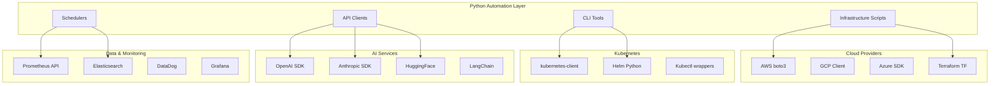

# Day 3: Python Automation

## Today's Learning Focus
- Python basics
- API integrations
- Infrastructure automation
- JSON/YAML handling
- AI SDKs & APIs
- Automation scripts

---

## Overview: Python as the Powerhouse of AI Automation

Python has become the lingua franca of AI infrastructure and automation. Its rich ecosystem of libraries, simple syntax, and extensive AI/ML support make it the ideal choice for:
- **Infrastructure as Code**: Automating cloud resources and Kubernetes deployments
- **AI API Integration**: Connecting to LLM providers, vector databases, and ML platforms
- **DevOps Automation**: CI/CD pipelines, monitoring, and incident response
- **Data Processing**: ETL pipelines, data transformation, and analysis
- **CLI Development**: Building developer tools and operational utilities

---

## Python Infrastructure Automation Architecture



---

## Core Python Scripts for Infrastructure

### Kubernetes Automation Client

```python
#!/usr/bin/env python3
"""
Kubernetes Infrastructure Automation Script
Manages AI workload deployments, scaling, and monitoring
"""

import os
import json
import logging
from typing import Optional, Dict, List
from kubernetes import client, config
from kubernetes.client.rest import ApiException
import yaml

logging.basicConfig(level=logging.INFO)
logger = logging.getLogger(__name__)

class K8sAIAutomation:
    def __init__(self, kubeconfig: Optional[str] = None):
        """Initialize Kubernetes client"""
        if kubeconfig:
            config.load_kube_config(config_file=kubeconfig)
        else:
            config.load_incluster_config()
        
        self.apps_v1 = client.AppsV1Api()
        self.batch_v1 = client.BatchV1Api()
        self.core_v1 = client.CoreV1Api()
        self.custom_objects = client.CustomObjectsApi()
    
    def deploy_inference_service(
        self,
        name: str,
        image: str,
        model_name: str,
        gpu_count: int = 1,
        replicas: int = 1,
        namespace: str = "default"
    ) -> Dict:
        """Deploy an AI inference service"""
        
        container = client.V1Container(
            name=name,
            image=image,
            args=[
                "--model", model_name,
                "--tensor-parallel-size", str(gpu_count)
            ],
            ports=[client.V1ContainerPort(container_port=8000)],
            resources=client.V1ResourceRequirements(
                requests={"nvidia.com/gpu": str(gpu_count), "memory": "10Gi"},
                limits={"nvidia.com/gpu": str(gpu_count), "memory": "20Gi"}
            ),
            liveness_probe=client.V1Probe(
                http_get=client.V1HTTPGetAction(path="/health", port=8000),
                initial_delay_seconds=60,
                period_seconds=10
            ),
            readiness_probe=client.V1Probe(
                http_get=client.V1HTTPGetAction(path="/ready", port=8000),
                initial_delay_seconds=10,
                period_seconds=5
            )
        )
        
        pod_template = client.V1PodTemplateSpec(
            metadata=client.V1ObjectMeta(labels={"app": name}),
            spec=client.V1PodSpec(containers=[container])
        )
        
        deployment = client.V1Deployment(
            api_version="apps/v1",
            kind="Deployment",
            metadata=client.V1ObjectMeta(name=name, namespace=namespace),
            spec=client.V1DeploymentSpec(
                replicas=replicas,
                selector=client.V1LabelSelector(match_labels={"app": name}),
                template=pod_template
            )
        )
        
        try:
            result = self.apps_v1.create_namespaced_deployment(
                namespace=namespace,
                body=deployment
            )
            logger.info(f"Deployment {name} created successfully")
            return {"status": "success", "deployment": result.metadata.name}
        except ApiException as e:
            logger.error(f"Failed to create deployment: {e}")
            return {"status": "error", "message": str(e)}
    
    def scale_deployment(self, name: str, replicas: int, namespace: str = "default"):
        """Scale a deployment"""
        try:
            self.apps_v1.patch_namespaced_deployment_scale(
                name=name,
                namespace=namespace,
                body={"spec": {"replicas": replicas}}
            )
            logger.info(f"Scaled {name} to {replicas} replicas")
            return {"status": "success"}
        except ApiException as e:
            logger.error(f"Failed to scale deployment: {e}")
            return {"status": "error", "message": str(e)}
    
    def get_gpu_utilization(self, namespace: str = "default") -> List[Dict]:
        """Get GPU utilization for pods in namespace"""
        metrics = []
        try:
            pods = self.core_v1.list_namespaced_pod(namespace=namespace)
            for pod in pods.items:
                if pod.status.phase == "Running":
                    for container in pod.spec.containers:
                        if container.resources.limits and "nvidia.com/gpu" in container.resources.limits:
                            metrics.append({
                                "pod": pod.metadata.name,
                                "gpu_limit": container.resources.limits["nvidia.com/gpu"],
                                "status": pod.status.phase
                            })
        except ApiException as e:
            logger.error(f"Failed to get pod metrics: {e}")
        return metrics
    
    def create_training_job(
        self,
        name: str,
        image: str,
        command: List[str],
        gpu_count: int = 1,
        namespace: str = "default"
    ):
        """Create a distributed training job"""
        job_spec = client.V1Job(
            api_version="batch/v1",
            kind="Job",
            metadata=client.V1ObjectMeta(name=name, namespace=namespace),
            spec=client.V1JobSpec(
                ttl_seconds_after_finished=3600,
                template=client.V1PodTemplateSpec(
                    spec=client.V1PodSpec(
                        containers=[
                            client.V1Container(
                                name="trainer",
                                image=image,
                                command=command,
                                resources=client.V1ResourceRequirements(
                                    requests={"nvidia.com/gpu": str(gpu_count)},
                                    limits={"nvidia.com/gpu": str(gpu_count)}
                                )
                            )
                        ],
                        restart_policy="OnFailure"
                    )
                )
            )
        )
        
        try:
            result = self.batch_v1.create_namespaced_job(namespace=namespace, body=job_spec)
            logger.info(f"Training job {name} created")
            return {"status": "success", "job": result.metadata.name}
        except ApiException as e:
            logger.error(f"Failed to create job: {e}")
            return {"status": "error", "message": str(e)}


# Usage Example
if __name__ == "__main__":
    k8s = K8sAIAutomation()
    
    # Deploy inference service
    k8s.deploy_inference_service(
        name="llama-inference",
        image="vllm/vllm-openai:latest",
        model_name="meta-llama/Llama-2-7b-hf",
        gpu_count=2,
        replicas=3
    )
    
    # Scale based on load
    k8s.scale_deployment("llama-inference", replicas=5)
    
    # Monitor GPU usage
    utilization = k8s.get_gpu_utilization()
    print(json.dumps(utilization, indent=2))
```

---

## AI API Integrations

### Multi-Provider LLM Client

```python
#!/usr/bin/env python3
"""
Unified LLM API Client for Multiple Providers
Supports OpenAI, Anthropic, Cohere, and local models
"""

import os
import json
import asyncio
from typing import Optional, Dict, Any, List
from abc import ABC, abstractmethod
import httpx
import backoff

class LLMProvider(ABC):
    """Abstract base class for LLM providers"""
    
    @abstractmethod
    async def generate(self, prompt: str, **kwargs) -> str:
        pass
    
    @abstractmethod
    async def generate_stream(self, prompt: str, **kwargs):
        pass

class OpenAIClient(LLMProvider):
    def __init__(self, api_key: Optional[str] = None, base_url: Optional[str] = None):
        self.api_key = api_key or os.getenv("OPENAI_API_KEY")
        self.base_url = base_url or "https://api.openai.com/v1"
        self.headers = {
            "Authorization": f"Bearer {self.api_key}",
            "Content-Type": "application/json"
        }
    
    @backoff.on_exception(backoff.expo, httpx.HTTPError, max_tries=3)
    async def generate(self, prompt: str, model: str = "gpt-4", **kwargs) -> str:
        async with httpx.AsyncClient() as client:
            payload = {
                "model": model,
                "messages": [{"role": "user", "content": prompt}],
                **kwargs
            }
            response = await client.post(
                f"{self.base_url}/chat/completions",
                headers=self.headers,
                json=payload,
                timeout=60.0
            )
            response.raise_for_status()
            return response.json()["choices"][0]["message"]["content"]
    
    async def generate_stream(self, prompt: str, model: str = "gpt-4", **kwargs):
        async with httpx.AsyncClient() as client:
            payload = {
                "model": model,
                "messages": [{"role": "user", "content": prompt}],
                "stream": True,
                **kwargs
            }
            async with client.stream(
                "POST",
                f"{self.base_url}/chat/completions",
                headers=self.headers,
                json=payload,
                timeout=60.0
            ) as response:
                async for line in response.aiter_lines():
                    if line.startswith("data: "):
                        data = line[6:]
                        if data != "[DONE]":
                            yield json.loads(data)

class OllamaClient(LLMProvider):
    """Client for local Ollama models"""
    
    def __init__(self, base_url: str = "http://localhost:11434"):
        self.base_url = base_url
    
    async def generate(self, prompt: str, model: str = "llama2", **kwargs) -> str:
        async with httpx.AsyncClient() as client:
            payload = {
                "model": model,
                "prompt": prompt,
                "stream": False,
                **kwargs
            }
            response = await client.post(
                f"{self.base_url}/api/generate",
                json=payload,
                timeout=300.0
            )
            response.raise_for_status()
            return response.json()["response"]

class UnifiedLLMClient:
    """Unified interface for multiple LLM providers"""
    
    def __init__(self):
        self.providers: Dict[str, LLMProvider] = {}
        self.register_provider("openai", OpenAIClient())
        self.register_provider("ollama", OllamaClient())
    
    def register_provider(self, name: str, provider: LLMProvider):
        self.providers[name] = provider
    
    async def generate(
        self,
        prompt: str,
        provider: str = "openai",
        fallback_providers: Optional[List[str]] = None,
        **kwargs
    ) -> str:
        """Generate with automatic fallback"""
        providers_to_try = [provider] + (fallback_providers or [])
        
        for prov in providers_to_try:
            try:
                if prov in self.providers:
                    return await self.providers[prov].generate(prompt, **kwargs)
                else:
                    raise ValueError(f"Unknown provider: {prov}")
            except Exception as e:
                print(f"Provider {prov} failed: {e}")
                continue
        
        raise RuntimeError("All providers failed")
    
    async def batch_generate(
        self,
        prompts: List[str],
        provider: str = "openai",
        concurrency: int = 5,
        **kwargs
    ) -> List[str]:
        """Batch generate with controlled concurrency"""
        semaphore = asyncio.Semaphore(concurrency)
        
        async def limited_generate(prompt):
            async with semaphore:
                return await self.providers[provider].generate(prompt, **kwargs)
        
        tasks = [limited_generate(prompt) for prompt in prompts]
        return await asyncio.gather(*tasks)


# Usage Example
async def main():
    client = UnifiedLLMClient()
    
    # Single generation with fallback
    response = await client.generate(
        "Explain quantum computing",
        provider="openai",
        fallback_providers=["ollama"]
    )
    print(response)
    
    # Batch generation
    prompts = ["What is AI?", "What is ML?", "What is DL?"]
    responses = await client.batch_generate(prompts, provider="openai", concurrency=3)
    
    for prompt, response in zip(prompts, responses):
        print(f"Q: {prompt}\nA: {response}\n")

if __name__ == "__main__":
    asyncio.run(main())
```

---

## JSON/YAML Parsing and Configuration Management

```python
#!/usr/bin/env python3
"""
Configuration Management for AI Infrastructure
Handles JSON/YAML parsing, validation, and templating
"""

import os
import json
import yaml
from pathlib import Path
from typing import Any, Dict, Optional, List
from pydantic import BaseModel, Field, validator
from jinja2 import Template
import hashlib

class ModelConfig(BaseModel):
    """Model configuration schema"""
    name: str
    provider: str
    version: str
    quantization: Optional[str] = None
    max_tokens: int = 4096
    temperature: float = 0.7

class ResourceConfig(BaseModel):
    """Resource configuration schema"""
    gpu_count: int = 1
    memory_gb: int = 16
    cpu_cores: int = 4
    storage_gb: int = 100

class DeploymentConfig(BaseModel):
    """Complete deployment configuration"""
    model: ModelConfig
    resources: ResourceConfig
    replicas: int = 1
    autoscaling: Optional[Dict[str, Any]] = None
    environment: Dict[str, str] = Field(default_factory=dict)
    
    @validator('replicas')
    def validate_replicas(cls, v):
        if v < 1:
            raise ValueError("Replicas must be at least 1")
        return v

class ConfigManager:
    """Manage configuration files for AI infrastructure"""
    
    def __init__(self, config_dir: str = "./configs"):
        self.config_dir = Path(config_dir)
        self.config_dir.mkdir(parents=True, exist_ok=True)
    
    def load_config(self, path: str) -> Dict[str, Any]:
        """Load configuration from JSON or YAML file"""
        file_path = self.config_dir / path
        
        if not file_path.exists():
            raise FileNotFoundError(f"Config file not found: {file_path}")
        
        with open(file_path, 'r') as f:
            if file_path.suffix in ['.yaml', '.yml']:
                return yaml.safe_load(f)
            elif file_path.suffix == '.json':
                return json.load(f)
            else:
                raise ValueError(f"Unsupported file format: {file_path.suffix}")
    
    def save_config(self, config: Dict[str, Any], path: str, format: str = "yaml"):
        """Save configuration to file"""
        file_path = self.config_dir / path
        
        if format == "yaml":
            with open(file_path, 'w') as f:
                yaml.dump(config, f, default_flow_style=False, sort_keys=False)
        elif format == "json":
            with open(file_path, 'w') as f:
                json.dump(config, f, indent=2)
        else:
            raise ValueError(f"Unsupported format: {format}")
    
    def validate_config(self, config: Dict[str, Any]) -> DeploymentConfig:
        """Validate configuration against schema"""
        return DeploymentConfig(**config)
    
    def render_template(self, template_path: str, variables: Dict[str, Any]) -> str:
        """Render Jinja2 template with variables"""
        template_file = self.config_dir / template_path
        
        with open(template_file, 'r') as f:
            template = Template(f.read())
        
        return template.render(**variables)
    
    def get_config_hash(self, config: Dict[str, Any]) -> str:
        """Generate hash for config change detection"""
        config_str = json.dumps(config, sort_keys=True)
        return hashlib.sha256(config_str.encode()).hexdigest()[:12]
    
    def merge_configs(self, *configs: Dict[str, Any]) -> Dict[str, Any]:
        """Deep merge multiple configurations"""
        result = {}
        for config in configs:
            for key, value in config.items():
                if key in result and isinstance(result[key], dict) and isinstance(value, dict):
                    result[key] = self.merge_configs(result[key], value)
                else:
                    result[key] = value
        return result


# Example configuration files
def create_example_configs():
    """Create example configuration files"""
    manager = ConfigManager()
    
    # Base configuration
    base_config = {
        "model": {
            "name": "llama-2-7b",
            "provider": "huggingface",
            "version": "latest",
            "quantization": "int4"
        },
        "resources": {
            "gpu_count": 1,
            "memory_gb": 16,
            "cpu_cores": 4
        },
        "replicas": 2
    }
    
    manager.save_config(base_config, "base-config.yaml")
    
    # Production overrides
    prod_config = {
        "replicas": 5,
        "autoscaling": {
            "min": 3,
            "max": 20,
            "target_cpu": 70
        },
        "environment": {
            "LOG_LEVEL": "INFO",
            "ENABLE_MONITORING": "true"
        }
    }
    
    manager.save_config(prod_config, "prod-overrides.yaml")
    
    # Merge configs
    final_config = manager.merge_configs(base_config, prod_config)
    validated = manager.validate_config(final_config)
    
    print(f"Validated config: {validated.dict()}")
    print(f"Config hash: {manager.get_config_hash(final_config)}")

if __name__ == "__main__":
    create_example_configs()
```

---

## CLI Development for DevOps

```python
#!/usr/bin/env python3
"""
AI Infrastructure CLI Tool
Comprehensive command-line interface for managing AI workloads
"""

import click
import json
import yaml
import asyncio
from typing import Optional, List
from rich.console import Console
from rich.table import Table
from rich.progress import Progress, SpinnerColumn, TextColumn
import httpx

console = Console()

@click.group()
@click.option('--verbose', '-v', is_flag=True, help='Enable verbose output')
@click.option('--config', '-c', default='~/.ai-infra/config.yaml', help='Config file path')
@click.pass_context
def cli(ctx, verbose, config):
    """AI Infrastructure Management CLI"""
    ctx.ensure_object(dict)
    ctx.obj['verbose'] = verbose
    ctx.obj['config'] = config

@cli.command()
@click.argument('model_name')
@click.option('--provider', '-p', default='openai', help='LLM provider')
@click.option('--prompt', '-P', required=True, help='Prompt to send')
@click.option('--stream', '-s', is_flag=True, help='Stream response')
def generate(model_name, provider, prompt, stream):
    """Generate text using an LLM"""
    console.print(f"[blue]Generating with {provider}/{model_name}...[/blue]")
    
    async def run_generation():
        async with httpx.AsyncClient() as client:
            if stream:
                # Streaming implementation
                async with client.stream('POST', '...') as response:
                    async for line in response.aiter_lines():
                        console.print(line, markup=False)
            else:
                response = await client.post('...', json={"prompt": prompt})
                console.print(response.json()['response'])
    
    asyncio.run(run_generation())

@cli.command()
@click.option('--namespace', '-n', default='default', help='Kubernetes namespace')
@click.option('--output', '-o', type=click.Choice(['table', 'json', 'yaml']), default='table')
def status(namespace, output):
    """Show AI workload status"""
    # Implementation would query Kubernetes API
    workloads = [
        {"name": "llama-inference", "replicas": "3/3", "gpu": "2", "status": "Running"},
        {"name": "embedding-service", "replicas": "2/2", "gpu": "1", "status": "Running"},
        {"name": "training-job", "replicas": "0/1", "gpu": "4", "status": "Pending"},
    ]
    
    if output == 'json':
        console.print_json(json.dumps(workloads))
    elif output == 'yaml':
        console.print(yaml.dump(workloads))
    else:
        table = Table(title=f"AI Workloads in {namespace}")
        table.add_column("Name", style="cyan")
        table.add_column("Replicas", style="green")
        table.add_column("GPUs", style="yellow")
        table.add_column("Status", style="red")
        
        for w in workloads:
            table.add_row(w['name'], w['replicas'], w['gpu'], w['status'])
        
        console.print(table)

@cli.command()
@click.argument('deployment_name')
@click.option('--replicas', '-r', required=True, type=int, help='Number of replicas')
@click.option('--namespace', '-n', default='default')
def scale(deployment_name, replicas, namespace):
    """Scale a deployment"""
    console.print(f"Scaling {deployment_name} to {replicas} replicas...")
    
    with Progress(
        SpinnerColumn(),
        TextColumn("[progress.description]{task.description}"),
    ) as progress:
        task = progress.add_task("Scaling...", total=None)
        # Implementation would call Kubernetes API
        asyncio.sleep(2)  # Simulated
        progress.stop_task(task)
    
    console.print("[green]✓[/green] Scaling complete!")

@cli.command()
@click.option('--gpu-type', '-g', default='all', help='GPU type filter')
@click.option('--output', '-o', type=click.Choice(['table', 'json']), default='table')
def gpu_status(gpu_type, output):
    """Show GPU cluster status"""
    gpu_info = [
        {"node": "gpu-node-1", "gpu": "A100", "used": "2/4", "memory": "40/80 GB"},
        {"node": "gpu-node-2", "gpu": "A10G", "used": "1/2", "memory": "12/24 GB"},
        {"node": "gpu-node-3", "gpu": "L4", "used": "0/4", "memory": "0/96 GB"},
    ]
    
    if output == 'json':
        console.print_json(json.dumps(gpu_info))
    else:
        table = Table(title="GPU Cluster Status")
        table.add_column("Node", style="cyan")
        table.add_column("GPU Type", style="magenta")
        table.add_column("Utilization", style="yellow")
        table.add_column("Memory", style="green")
        
        for gpu in gpu_info:
            table.add_row(gpu['node'], gpu['gpu'], gpu['used'], gpu['memory'])
        
        console.print(table)

@cli.command()
@click.argument('config_file')
@click.option('--dry-run', '-d', is_flag=True, help='Dry run mode')
def deploy(config_file, dry_run):
    """Deploy AI infrastructure from config"""
    console.print(f"Deploying from {config_file}...")
    
    if dry_run:
        console.print("[yellow]DRY RUN - No changes will be made[/yellow]")
        return
    
    # Load and validate config
    with open(config_file, 'r') as f:
        if config_file.endswith('.yaml'):
            config = yaml.safe_load(f)
        else:
            config = json.load(f)
    
    # Deployment logic here
    console.print("[green]✓[/green] Deployment successful!")

@cli.command()
def logs():
    """Tail logs from AI services"""
    console.print("[blue]Tailing logs...[/blue]")
    # Implementation would stream logs from Kubernetes

@cli.command()
def cost():
    """Show cost analysis for AI workloads"""
    cost_data = {
        "current_month": 12450.00,
        "previous_month": 10200.00,
        "breakdown": {
            "compute": 8500.00,
            "storage": 1200.00,
            "network": 750.00,
            "api_calls": 2000.00
        }
    }
    
    table = Table(title="Cost Analysis")
    table.add_column("Category", style="cyan")
    table.add_column("Cost (USD)", style="green", justify="right")
    
    for category, cost in cost_data['breakdown'].items():
        table.add_row(category, f"${cost:,.2f}")
    
    table.add_row("Total", f"${cost_data['current_month']:,.2f}", style="bold")
    
    console.print(table)

if __name__ == '__main__':
    cli()
```

### CLI Installation

```bash
# Install dependencies
pip install click rich pydantic kubernetes httpx pyyaml

# Install CLI
pip install -e .

# Or run directly
python ai_infra_cli.py --help
```

---

## Async Workflows and Task Queues

```python
#!/usr/bin/env python3
"""
Async Task Queue for AI Workloads
Handles distributed processing, retries, and monitoring
"""

import asyncio
import aiohttp
from typing import Any, Dict, List, Optional, Callable
from dataclasses import dataclass, field
from datetime import datetime
import redis.asyncio as redis
import json
import uuid
from enum import Enum

class TaskStatus(Enum):
    PENDING = "pending"
    RUNNING = "running"
    COMPLETED = "completed"
    FAILED = "failed"
    RETRYING = "retrying"

@dataclass
class Task:
    id: str
    name: str
    payload: Dict[str, Any]
    status: TaskStatus = TaskStatus.PENDING
    retries: int = 0
    max_retries: int = 3
    created_at: datetime = field(default_factory=datetime.utcnow)
    completed_at: Optional[datetime] = None
    error: Optional[str] = None
    result: Optional[Any] = None

class AsyncTaskQueue:
    """Distributed async task queue for AI workloads"""
    
    def __init__(self, redis_url: str = "redis://localhost"):
        self.redis = redis.from_url(redis_url)
        self.queue_key = "ai_tasks:queue"
        self.processing_key = "ai_tasks:processing"
        self.results_key = "ai_tasks:results"
    
    async def enqueue(self, task: Task):
        """Add task to queue"""
        task_data = {
            "id": task.id,
            "name": task.name,
            "payload": task.payload,
            "max_retries": task.max_retries,
            "retries": task.retries,
            "created_at": task.created_at.isoformat()
        }
        await self.redis.lpush(self.queue_key, json.dumps(task_data))
    
    async def dequeue(self, timeout: int = 5) -> Optional[Task]:
        """Get next task from queue"""
        result = await self.redis.brpop(self.queue_key, timeout=timeout)
        if result:
            task_data = json.loads(result[1])
            await self.redis.hset(
                self.processing_key,
                task_data["id"],
                json.dumps(task_data)
            )
            return Task(
                id=task_data["id"],
                name=task_data["name"],
                payload=task_data["payload"],
                max_retries=task_data["max_retries"],
                retries=task_data["retries"]
            )
        return None
    
    async def complete(self, task: Task, result: Any):
        """Mark task as completed"""
        task.status = TaskStatus.COMPLETED
        task.completed_at = datetime.utcnow()
        task.result = result
        
        await self.redis.hdel(self.processing_key, task.id)
        await self.redis.hset(
            self.results_key,
            task.id,
            json.dumps({
                "result": result,
                "completed_at": task.completed_at.isoformat()
            })
        )
    
    async def fail(self, task: Task, error: str):
        """Handle task failure with retry logic"""
        task.error = error
        task.retries += 1
        
        if task.retries < task.max_retries:
            task.status = TaskStatus.RETRYING
            # Re-enqueue with exponential backoff
            await asyncio.sleep(2 ** task.retries)
            await self.enqueue(task)
        else:
            task.status = TaskStatus.FAILED
            task.completed_at = datetime.utcnow()
            await self.redis.hdel(self.processing_key, task.id)
    
    async def get_result(self, task_id: str) -> Optional[Any]:
        """Get task result"""
        result = await self.redis.hget(self.results_key, task_id)
        if result:
            return json.loads(result)
        return None

class AIWorkflowEngine:
    """Orchestrate multi-step AI workflows"""
    
    def __init__(self, queue: AsyncTaskQueue):
        self.queue = queue
        self.handlers: Dict[str, Callable] = {}
    
    def register_handler(self, name: str, handler: Callable):
        """Register workflow step handler"""
        self.handlers[name] = handler
    
    async def run_workflow(self, steps: List[Dict[str, Any]], context: Dict[str, Any] = None):
        """Execute multi-step workflow"""
        context = context or {}
        results = {}
        
        for step in steps:
            step_name = step["name"]
            handler = self.handlers.get(step_name)
            
            if not handler:
                raise ValueError(f"Handler not found: {step_name}")
            
            # Prepare input from previous steps
            step_input = {**context, **results}
            if "input_mapping" in step:
                step_input = {k: step_input.get(v) for k, v in step["input_mapping"].items()}
            
            # Create and execute task
            task = Task(
                id=str(uuid.uuid4()),
                name=step_name,
                payload=step_input
            )
            
            await self.queue.enqueue(task)
            
            # Wait for completion
            while True:
                queued_task = await self.queue.dequeue(timeout=1)
                if queued_task and queued_task.id == task.id:
                    try:
                        result = await handler(queued_task.payload)
                        await self.queue.complete(queued_task, result)
                        results[step_name] = result
                        break
                    except Exception as e:
                        await self.queue.fail(queued_task, str(e))
                        if queued_task.status == TaskStatus.FAILED:
                            raise
        
        return results

# Example workflow handlers
async def fetch_document(payload: Dict) -> str:
    """Fetch document for processing"""
    async with aiohttp.ClientSession() as session:
        async with session.get(payload["url"]) as resp:
            return await resp.text()

async def generate_embeddings(payload: Dict) -> List[float]:
    """Generate embeddings for text"""
    # Call embedding API
    return [0.1, 0.2, 0.3]  # Placeholder

async def store_in_vector_db(payload: Dict):
    """Store embeddings in vector database"""
    # Store in Chroma/Qdrant
    return {"status": "stored", "id": payload.get("doc_id")}

async def main():
    queue = AsyncTaskQueue()
    engine = AIWorkflowEngine(queue)
    
    # Register handlers
    engine.register_handler("fetch", fetch_document)
    engine.register_handler("embed", generate_embeddings)
    engine.register_handler("store", store_in_vector_db)
    
    # Define workflow
    workflow = [
        {"name": "fetch", "input_mapping": {"url": "document_url"}},
        {"name": "embed", "input_mapping": {"text": "fetch"}},
        {"name": "store", "input_mapping": {"embeddings": "embed"}}
    ]
    
    # Execute workflow
    results = await engine.run_workflow(
        workflow,
        context={"document_url": "https://example.com/doc.txt"}
    )
    
    print(f"Workflow completed: {results}")

if __name__ == "__main__":
    asyncio.run(main())
```

---

## REST API Handling and Webhooks

```python
#!/usr/bin/env python3
"""
REST API Server for AI Infrastructure
FastAPI-based API for managing AI workloads
"""

from fastapi import FastAPI, HTTPException, BackgroundTasks, Depends, Security
from fastapi.security import HTTPBearer, HTTPAuthorizationCredentials
from pydantic import BaseModel, Field
from typing import Optional, List, Dict, Any
import uvicorn
import asyncio
import httpx
from datetime import datetime

app = FastAPI(title="AI Infrastructure API", version="1.0.0")
security = HTTPBearer()

# Models
class InferenceRequest(BaseModel):
    model: str
    prompt: str
    max_tokens: int = 1024
    temperature: float = 0.7
    stream: bool = False

class InferenceResponse(BaseModel):
    model: str
    completion: str
    tokens_used: int
    latency_ms: float

class DeploymentRequest(BaseModel):
    name: str
    model: str
    replicas: int = 1
    gpu_count: int = 1
    resources: Optional[Dict[str, Any]] = None

class ScaleRequest(BaseModel):
    replicas: int = Field(ge=1, le=100)

class HealthResponse(BaseModel):
    status: str
    timestamp: datetime
    services: Dict[str, str]

# Authentication
async def verify_token(credentials: HTTPAuthorizationCredentials = Security(security)):
    """Verify API token"""
    # Implement actual token verification
    valid_tokens = ["your-secret-token"]
    if credentials.credentials not in valid_tokens:
        raise HTTPException(status_code=401, detail="Invalid token")
    return credentials.credentials

# Endpoints
@app.get("/health", response_model=HealthResponse)
async def health_check():
    """Health check endpoint"""
    return HealthResponse(
        status="healthy",
        timestamp=datetime.utcnow(),
        services={
            "kubernetes": "connected",
            "model_registry": "connected",
            "monitoring": "connected"
        }
    )

@app.post("/infer", response_model=InferenceResponse)
async def inference(
    request: InferenceRequest,
    token: str = Depends(verify_token)
):
    """Run inference on deployed model"""
    start_time = datetime.utcnow()
    
    # Call inference service
    async with httpx.AsyncClient() as client:
        response = await client.post(
            f"http://inference-service:8000/generate",
            json=request.dict(),
            timeout=60.0
        )
        
        if response.status_code != 200:
            raise HTTPException(status_code=500, detail="Inference failed")
        
        result = response.json()
    
    latency = (datetime.utcnow() - start_time).total_seconds() * 1000
    
    return InferenceResponse(
        model=request.model,
        completion=result["text"],
        tokens_used=result["tokens"],
        latency_ms=latency
    )

@app.post("/deploy")
async def deploy_model(
    request: DeploymentRequest,
    background_tasks: BackgroundTasks,
    token: str = Depends(verify_token)
):
    """Deploy a new model"""
    # Start async deployment
    background_tasks.add_task(async_deploy, request)
    
    return {
        "status": "deploying",
        "deployment_name": request.name,
        "estimated_time_seconds": 120
    }

async def async_deploy(request: DeploymentRequest):
    """Background deployment task"""
    # Implement Kubernetes deployment logic
    await asyncio.sleep(10)  # Simulated deployment

@app.post("/deployments/{name}/scale")
async def scale_deployment(
    name: str,
    request: ScaleRequest,
    token: str = Depends(verify_token)
):
    """Scale a deployment"""
    # Implement scaling logic
    return {
        "status": "scaling",
        "deployment": name,
        "new_replicas": request.replicas
    }

@app.get("/deployments")
async def list_deployments(token: str = Depends(verify_token)):
    """List all deployments"""
    return {
        "deployments": [
            {"name": "llama-7b", "replicas": 3, "status": "running"},
            {"name": "embedding-model", "replicas": 2, "status": "running"}
        ]
    }

@app.get("/metrics")
async def get_metrics(token: str = Depends(verify_token)):
    """Get infrastructure metrics"""
    return {
        "gpu_utilization": 0.75,
        "memory_usage_gb": 128,
        "requests_per_second": 150,
        "average_latency_ms": 245
    }

# Webhook handlers
@app.post("/webhooks/alert")
async def handle_alert(webhook_data: Dict[str, Any]):
    """Handle monitoring alerts"""
    alert_type = webhook_data.get("type")
    
    if alert_type == "high_gpu_usage":
        # Auto-scale inference service
        pass
    elif alert_type == "model_drift":
        # Trigger retraining
        pass
    
    return {"status": "processed"}

if __name__ == "__main__":
    uvicorn.run(app, host="0.0.0.0", port=8000)
```

---

## Best Practices

### Code Organization
- Use type hints for better IDE support
- Implement proper error handling with retries
- Use async/await for I/O operations
- Follow PEP 8 style guidelines
- Write comprehensive tests

### Security
- Never hardcode credentials
- Use environment variables or secret managers
- Implement rate limiting
- Validate all inputs
- Use HTTPS for API calls

### Performance
- Use connection pooling for HTTP clients
- Implement caching where appropriate
- Use async operations for concurrent tasks
- Monitor and profile performance
- Optimize serialization/deserialization

### Testing
```python
# Example test file
import pytest
from unittest.mock import AsyncMock, patch

@pytest.mark.asyncio
async def test_inference_api():
    with patch('httpx.AsyncClient.post') as mock_post:
        mock_post.return_value.json.return_value = {"text": "test", "tokens": 10}
        # Test logic here
```

---

## Troubleshooting

| Issue | Symptoms | Solution |
|-------|----------|----------|
| Connection timeouts | API calls hang | Increase timeout, check network |
| Memory leaks | Growing memory usage | Check for unclosed sessions |
| Rate limiting | 429 errors | Implement exponential backoff |
| Authentication failures | 401 errors | Verify token refresh logic |
| Serialization errors | JSON decode errors | Validate response format |

---

## Additional Resources

- [Kubernetes Python Client](https://github.com/kubernetes-client/python)
- [FastAPI Documentation](https://fastapi.tiangolo.com/)
- [AsyncIO Best Practices](https://docs.python.org/3/library/asyncio.html)
- [Pydantic Documentation](https://docs.pydantic.dev/)
- [Click CLI Framework](https://click.palletsprojects.com/)

---

*Generated as part of the 12-Day AI Infrastructure Learning Path*
