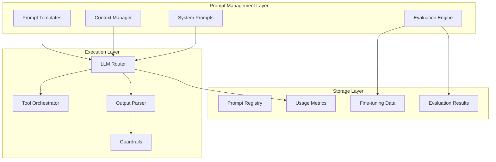

# Day 4: Prompt Engineering

## Today's Learning Focus
- Prompt structures
- Context windows
- System prompts
- Tool calling
- AI evaluations
- Multi-step reasoning

---

## Overview: Prompt Engineering as Infrastructure Logic

Prompt engineering is the infrastructure logic for AI systems. Just as traditional software uses code to define behavior, AI systems use prompts to control model outputs, manage context, orchestrate tools, and ensure reliable production behavior. Well-engineered prompts are:
- **Reusable**: Template-based with variable substitution
- **Testable**: Evaluated against test cases
- **Versioned**: Tracked like code
- **Monitored**: Measured for quality and cost
- **Secure**: Protected against injection attacks

---

## Architecture Diagram



---

## Prompt Patterns

### Zero-Shot Prompting

```python
prompt = """
Classify the sentiment of this text as positive, negative, or neutral.

Text: "The product exceeded my expectations!"
Sentiment:
"""
```

### Few-Shot Prompting

```python
prompt = """
Extract entities from text.

Example 1:
Text: "Apple released new iPhones in Cupertino"
Entities: {"ORG": ["Apple"], "PRODUCT": ["iPhones"], "LOCATION": ["Cupertino"]}

Example 2:
Text: "Elon Musk founded SpaceX in 2002"
Entities: {"PERSON": ["Elon Musk"], "ORG": ["SpaceX"], "DATE": ["2002"]}

Now extract from:
Text: "Google acquired YouTube for $1.65 billion in 2006"
Entities:
"""
```

### Chain-of-Thought Prompting

```python
prompt = """
Q: John has 5 apples. He buys 3 more, then gives away 2. How many does he have?
A: Let's think step by step:
- John starts with 5 apples
- He buys 3 more: 5 + 3 = 8 apples
- He gives away 2: 8 - 2 = 6 apples
Answer: 6

Q: A train travels at 60 mph for 2.5 hours. How far does it travel?
A: Let's think step by step:
"""
```

---

## Troubleshooting

| Issue | Symptoms | Solution |
|-------|----------|----------|
| Inconsistent outputs | Same prompt, different answers | Lower temperature, add more constraints |
| Hallucinations | Made-up facts | Add "don't guess" instruction, use RAG |
| Too verbose | Long-winded responses | Set max_tokens, add brevity instruction |
| Ignoring format | Wrong output structure | Use few-shot examples, stricter schema |

---

*Generated as part of the 12-Day AI Infrastructure Learning Path*
