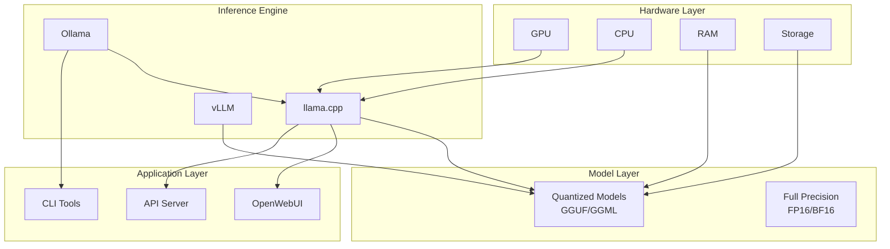
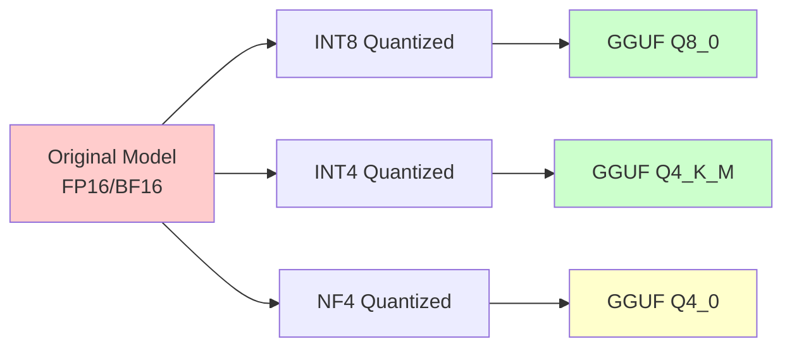

# Day 5: Local LLMs

## Today's Learning Focus
- Ollama
- llama.cpp
- Quantization
- GPU optimization
- OpenWebUI
- Local inference workflows

---

## Overview: Local AI Systems Changing Infrastructure Engineering

Local AI systems are transforming infrastructure engineering by enabling:
- **Data Privacy**: Sensitive data never leaves your infrastructure
- **Cost Control**: Eliminate API costs for high-volume workloads
- **Low Latency**: No network round-trips for inference
- **Customization**: Fine-tune models for specific domains
- **Offline Capability**: Run without internet connectivity
- **Compliance**: Meet regulatory requirements for data residency

---

## Architecture Diagram



---

## Ollama Setup

### Installation

```bash
# Linux installation
curl -fsSL https://ollama.com/install.sh | sh

# macOS installation
brew install ollama

# Docker deployment
docker run -d --gpus all -v ollama:/root/.ollama \
  -p 11434:11434 --name ollama ollama/ollama
```

### Model Management

```bash
# Pull a model
ollama pull llama2

# List local models
ollama list

# Run interactive chat
ollama run llama2 "Hello, how are you?"

# Create custom model
ollama create my-model -f ./Modelfile

# Remove model
ollama rm llama2
```

### Modelfile Example

```dockerfile
FROM llama2:7b

PARAMETER temperature 0.7
PARAMETER top_p 0.9
PARAMETER num_ctx 4096

SYSTEM """You are a helpful coding assistant.
Always provide clear, well-commented code examples."""
```

---

## llama.cpp Optimization

### Building from Source

```bash
git clone https://github.com/ggerganov/llama.cpp
cd llama.cpp

# Build with CUDA support
make LLAMA_CUDA=1

# Build with Metal support (macOS)
make LLAMA_METAL=1

# Build with OpenBLAS
make LLAMA_OPENBLAS=1
```

### Inference Commands

```bash
# Basic inference
./main -m models/llama-2-7b.gguf -p "Hello" -n 256

# With GPU offloading
./main -m models/llama-2-7b.gguf -p "Hello" -ngl 35

# Batch processing
./main -m models/llama-2-7b.gguf -f prompts.txt -t 8

# Server mode
./server -m models/llama-2-7b.gguf --host 0.0.0.0 -c 4096
```

### Performance Tuning

| Parameter | Description | Recommended Value |
|-----------|-------------|-------------------|
| `-ngl` | GPU layers to offload | 35-40 for 7B models |
| `-t` | Number of threads | CPU core count |
| `-c` | Context size | 2048-8192 |
| `-b` | Batch size | 512-2048 |
| `--mlock` | Lock model in RAM | Use for large models |

---

## Quantization Explained

### Quantization Formats



### Quantization Comparison

| Format | Size Reduction | Quality Loss | Best For |
|--------|---------------|--------------|----------|
| Q8_0 | ~50% | Minimal | Production |
| Q5_K_M | ~65% | Low | General use |
| Q4_K_M | ~70% | Moderate | Resource-constrained |
| Q3_K_S | ~75% | Noticeable | Edge devices |
| Q2_K | ~80% | Significant | Testing only |

### Converting Models

```bash
# Convert to GGUF
python convert.py --outfile model.gguf model_dir/

# Quantize existing GGUF
./quantize model.gguf model-q4.gguf q4_k_m

# Using llama.cpp scripts
python -m llama_cpp.convert --model-id meta-llama/Llama-2-7b-hf \
  --outfile Llama-2-7b.gguf --outtype f16
```

---

## GPU Tuning

### NVIDIA GPU Optimization

```bash
# Check GPU compatibility
nvidia-smi

# Set optimal power limit
sudo nvidia-smi -pl 250

# Monitor during inference
watch -n 1 nvidia-smi

# CUDA environment variables
export CUDA_VISIBLE_DEVICES=0
export PYTORCH_CUDA_ALLOC_CONF=max_split_size_mb:512
```

### Memory Management

```python
import torch

# Clear CUDA cache
torch.cuda.empty_cache()

# Set memory fraction
torch.cuda.set_per_process_memory_fraction(0.8)

# Enable TF32 for faster computation
torch.backends.cuda.matmul.allow_tf32 = True
torch.backends.cudnn.allow_tf32 = True
```

---

## Dockerized Local AI

### Docker Compose for Ollama + OpenWebUI

```yaml
version: '3.8'

services:
  ollama:
    image: ollama/ollama:latest
    container_name: ollama
    deploy:
      resources:
        reservations:
          devices:
            - driver: nvidia
              count: all
              capabilities: [gpu]
    volumes:
      - ollama_data:/root/.ollama
    ports:
      - "11434:11434"
    restart: unless-stopped

  openwebui:
    image: ghcr.io/open-webui/open-webui:main
    container_name: openwebui
    environment:
      - OLLAMA_BASE_URL=http://ollama:11434
    ports:
      - "3000:8080"
    volumes:
      - openwebui_data:/app/backend/data
    depends_on:
      - ollama
    restart: unless-stopped

volumes:
  ollama_data:
  openwebui_data:
```

---

## Kubernetes Local Inference

### Deployment Manifest

```yaml
apiVersion: apps/v1
kind: Deployment
metadata:
  name: local-llm-inference
spec:
  replicas: 2
  selector:
    matchLabels:
      app: local-llm
  template:
    metadata:
      labels:
        app: local-llm
    spec:
      containers:
        - name: vllm
          image: vllm/vllm-openai:latest
          args:
            - --model
            - /models/llama-2-7b.gguf
            - --tensor-parallel-size
            - "1"
            - --max-model-len
            - "4096"
          resources:
            limits:
              nvidia.com/gpu: 1
              memory: 20Gi
            requests:
              nvidia.com/gpu: 1
              memory: 10Gi
          volumeMounts:
            - name: models
              mountPath: /models
          ports:
            - containerPort: 8000
      volumes:
        - name: models
          persistentVolumeClaim:
            claimName: llm-models-pvc
```

---

## Offline AI Systems

### Air-Gapped Deployment

```bash
# Export model for offline use
ollama cp llama2 /mnt/external/models/llama2.bin

# Create offline bundle
tar czf offline-ai-bundle.tar.gz \
  ollama-binary \
  models/ \
  openwebui-docker-image.tar

# On offline machine
tar xzf offline-ai-bundle.tar.gz
./ollama serve &
```

### Model Caching Strategy

```python
class OfflineModelCache:
    def __init__(self, cache_dir: str):
        self.cache_dir = Path(cache_dir)
        self.manifest_file = self.cache_dir / "manifest.json"
    
    def download_and_cache(self, model_id: str):
        # Download model when online
        pass
    
    def load_from_cache(self, model_id: str):
        # Load cached model for offline use
        pass
    
    def verify_integrity(self, model_id: str) -> bool:
        # Verify model checksum
        pass
```

---

## OpenWebUI Deployment

### Configuration

```yaml
# config.yaml
DEFAULT_MODELS:
  - llama2:7b
  - mistral:7b
  - codellama:7b

FEATURES:
  rag_enabled: true
  web_search: false
  image_generation: false

AUTH:
  enabled: true
  registration: false

STORAGE:
  type: local
  path: /data
```

### Custom Integration

```python
from fastapi import FastAPI
import httpx

app = FastAPI()

@app.post("/api/chat")
async def chat(prompt: str, model: str = "llama2"):
    async with httpx.AsyncClient() as client:
        response = await client.post(
            "http://ollama:11434/api/generate",
            json={"model": model, "prompt": prompt}
        )
        return response.json()
```

---

## Troubleshooting

| Issue | Symptoms | Solution |
|-------|----------|----------|
| Out of memory | CUDA OOM errors | Reduce context size, use quantized model |
| Slow inference | High latency | Increase GPU offloading, check thermal throttling |
| Model loading fails | File not found | Verify GGUF format, check file integrity |
| GPU not utilized | CPU-only fallback | Install CUDA drivers, check device visibility |

---

*Generated as part of the 12-Day AI Infrastructure Learning Path*
