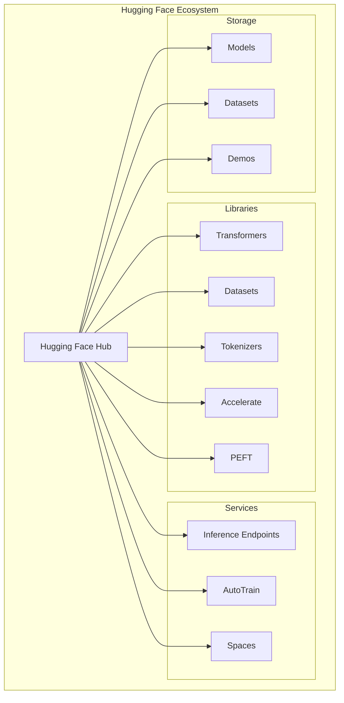

# Day 6 — Hugging Face Ecosystem

> **The GitHub of AI: Models, Datasets, and Open-Source Collaboration**

## 📋 Table of Contents

- [Overview](#overview)
- [Learning Objectives](#learning-objectives)
- [Hugging Face Platform Overview](#hugging-face-platform-overview)
- [Transformers Architecture](#transformers-architecture)
- [Model Hub & Registry](#model-hub--registry)
- [Datasets Library](#datasets-library)
- [Safetensors Security](#safetensors-security)
- [Fine-Tuning Fundamentals](#fine-tuning-fundamentals)
- [Inference APIs](#inference-apis)
- [Hugging Face CLI](#hugging-face-cli)
- [Open-Source AI Workflows](#open-source-ai-workflows)
- [Best Practices](#best-practices)
- [Troubleshooting](#troubleshooting)

---

## Overview

Hugging Face has become the **central hub for open-source AI**, providing:
- Model repository (like GitHub for ML models)
- Dataset library for efficient data loading
- Transformers library for model inference and training
- Inference endpoints for production deployment
- Community-driven collaboration and sharing

### Why Hugging Face Matters

| Aspect | Impact |
|--------|--------|
| **Accessibility** | Democratizes access to state-of-the-art models |
| **Standardization** | Unified API across thousands of models |
| **Community** | 500K+ models, 100K+ datasets shared |
| **Production** | Enterprise-ready inference and deployment tools |
| **Security** | Safetensors format prevents code execution |

---

## Learning Objectives

By the end of this module, you will:

- ✅ Understand the Hugging Face ecosystem architecture
- ✅ Load and use pre-trained models efficiently
- ✅ Manage datasets with the datasets library
- ✅ Implement safe model loading with Safetensors
- ✅ Fine-tune models for specific tasks
- ✅ Deploy models using Inference Endpoints
- ✅ Use Hugging Face CLI for automation
- ✅ Build open-source AI workflows

---

## Hugging Face Platform Overview

### Ecosystem Components



### Key Statistics

| Component | Count | Description |
|-----------|-------|-------------|
| Models | 500,000+ | Pre-trained models for various tasks |
| Datasets | 50,000+ | Curated datasets for training |
| Spaces | 100,000+ | Hosted ML demo applications |
| Organizations | 10,000+ | Companies and research groups |
| Downloads/Month | 100M+ | Model and dataset downloads |

---

## Transformers Architecture

### Pipeline API

The simplest way to use models:

```python
from transformers import pipeline

# Text classification
classifier = pipeline("sentiment-analysis")
result = classifier("I love building AI infrastructure!")
print(result)  # [{'label': 'POSITIVE', 'score': 0.9998}]

# Question answering
qa = pipeline("question-answering")
answer = qa(
    question="What is the best practice for GPU scheduling?",
    context="GPU scheduling in Kubernetes requires careful resource allocation..."
)

# Text generation
generator = pipeline("text-generation", model="meta-llama/Llama-2-7b")
output = generator("Explain Kubernetes architecture", max_length=200)

# Zero-shot classification
classifier = pipeline("zero-shot-classification")
result = classifier(
    "GPU memory is exhausted on node pool",
    candidate_labels=["infrastructure", "application", "networking"]
)
```

### Model Loading Patterns

```python
from transformers import AutoModel, AutoTokenizer, AutoModelForCausalLM

# Basic loading
model_name = "mistralai/Mistral-7B-Instruct-v0.2"
tokenizer = AutoTokenizer.from_pretrained(model_name)
model = AutoModelForCausalLM.from_pretrained(model_name)

# Loading with optimizations
model = AutoModelForCausalLM.from_pretrained(
    model_name,
    torch_dtype=torch.float16,           # Mixed precision
    device_map="auto",                    # Automatic device placement
    load_in_8bit=True,                    # 8-bit quantization
    trust_remote_code=False,              # Security: disable remote code
    use_safetensors=True                  # Safe tensor format
)

# Loading specific revisions
model = AutoModel.from_pretrained(
    model_name,
    revision="v1.0.0",                    # Specific version
    token=os.getenv("HF_TOKEN")           # Authentication for gated models
)
```

### Architecture Components

```python
class TransformerModelComponents:
    """Understanding transformer model components"""
    
    # Tokenizer: Converts text to tokens
    tokenizer = AutoTokenizer.from_pretrained("bert-base-uncased")
    tokens = tokenizer("Hello world!", return_tensors="pt")
    # Output: {'input_ids': tensor([[101, 7592, 2088, 102]]), ...}
    
    # Embedding Layer: Converts tokens to vectors
    # Hidden within the model
    
    # Attention Mechanism: Context understanding
    # Implemented in model layers
    
    # Feed-Forward Networks: Processing
    # Implemented in model layers
    
    # Output Head: Task-specific output
    # Varies by task (classification, generation, etc.)
```

---

## Model Hub & Registry

### Browsing Models

```python
from huggingface_hub import HfApi, list_models

api = HfApi()

# Search models by task
models = list_models(task="text-classification", limit=10)

# Search by library
models = list_models(library="transformers", sort="downloads", direction=-1)

# Filter by tags
models = list_models(
    tags=["pytorch", "transformers", "en"],
    search="sentiment"
)

# Get model info
model_info = api.model_info("bert-base-uncased")
print(f"Downloads: {model_info.downloads}")
print(f"Tags: {model_info.tags}")
print(f"Pipeline Tag: {model_info.pipeline_tag}")
```

### Model Cards

Every model should have a README.md with:

```markdown
---
language: en
tags:
  - sentiment-analysis
  - binary-classification
license: apache-2.0
datasets:
  - imdb
metrics:
  - accuracy
  - f1
---

# Model Description

This model performs sentiment analysis on English text.

## Training Procedure

Trained on IMDB dataset with the following hyperparameters:
- Learning rate: 2e-5
- Batch size: 32
- Epochs: 3

## Usage

```python
from transformers import pipeline
classifier = pipeline("sentiment-analysis", model="username/model-name")
```

## Limitations

- Only works on English text
- May struggle with sarcasm
```

### Version Control for Models

```python
from huggingface_hub import HfApi

api = HfApi()

# Create repository
api.create_repo(repo_id="my-org/my-model", repo_type="model")

# Upload model with commit message
api.upload_folder(
    folder_path="./model_output",
    repo_id="my-org/my-model",
    commit_message="Upload v1.0.0 - Initial release"
)

# Create tags for versioning
api.create_tag(
    repo_id="my-org/my-model",
    tag="v1.0.0",
    revision="main"
)

# Upload new version
api.upload_folder(
    folder_path="./model_output_v2",
    repo_id="my-org/my-model",
    commit_message="Release v2.0.0 - Improved accuracy"
)
api.create_tag(repo_id="my-org/my-model", tag="v2.0.0")
```

---

## Datasets Library

### Loading Datasets

```python
from datasets import load_dataset

# Load from Hugging Face Hub
dataset = load_dataset("imdb", split="train")

# Load specific subset
dataset = load_dataset("glue", "sst2", split="train")

# Load from local files
dataset = load_dataset("csv", data_files="data/train.csv")
dataset = load_dataset("json", data_files="data/train.jsonl")

# Load from directory
dataset = load_dataset("parquet", data_dir="data/parquet/")
```

### Dataset Operations

```python
from datasets import concatenate_datasets, DatasetDict

# Split dataset
dataset = dataset.train_test_split(test_size=0.2, seed=42)

# Map functions
def preprocess(example):
    example["text"] = example["text"].lower()
    example["length"] = len(example["text"].split())
    return example

dataset = dataset.map(preprocess)

# Filter
filtered = dataset.filter(lambda x: x["length"] > 10)

# Select columns
reduced = dataset.select_columns(["text", "label"])

# Concatenate datasets
combined = concatenate_datasets([dataset1, dataset2])

# Create DatasetDict
dataset_dict = DatasetDict({
    "train": train_dataset,
    "validation": val_dataset,
    "test": test_dataset
})
```

### Efficient Data Loading

```python
# Streaming for large datasets
dataset = load_dataset("common_voice", "en", split="train", streaming=True)
for example in dataset:
    process(example)  # Process without downloading entire dataset

# Memory mapping
dataset = load_dataset("wikipedia", "20220301.en", trust_remote_code=False)

# Batch processing
dataset = dataset.map(
    preprocess_function,
    batched=True,
    batch_size=1000,
    num_proc=4  # Parallel processing
)
```

### Custom Dataset Creation

```python
from datasets import Dataset

# Create from dictionary
data = {
    "text": ["Sample 1", "Sample 2", "Sample 3"],
    "label": [0, 1, 0]
}
dataset = Dataset.from_dict(data)

# Create from pandas
import pandas as pd
df = pd.read_csv("data.csv")
dataset = Dataset.from_pandas(df)

# Create from generators
def gen():
    for i in range(1000):
        yield {"id": i, "text": f"Document {i}"}

dataset = Dataset.from_generator(gen)

# Save to disk
dataset.save_to_disk("my_dataset")

# Load from disk
dataset = Dataset.load_from_disk("my_dataset")
```

---

## Safetensors Security

### What is Safetensors?

Safetensors is a **secure tensor format** that prevents arbitrary code execution:

| Feature | PyTorch (.bin) | Safetensors (.safetensors) |
|---------|---------------|---------------------------|
| Code Execution | Possible | ❌ Impossible |
| Loading Speed | Standard | ✅ Faster |
| Validation | Manual | ✅ Built-in |
| Security Risk | ⚠️ Higher | ✅ Lower |

### Using Safetensors

```python
from transformers import AutoModel

# Load with safetensors (recommended)
model = AutoModel.from_pretrained(
    "microsoft/deberta-v3-base",
    use_safetensors=True  # Automatically uses .safetensors if available
)

# Verify file format
from safetensors.torch import load_file

tensors = load_file("model.safetensors")
print(tensors.keys())  # View tensor names without loading

# Safe loading with validation
from safetensors import safe_open

with safe_open("model.safetensors", framework="pt", device="cpu") as f:
    for key in f.keys():
        tensor = f.get_tensor(key)
        print(f"{key}: {tensor.shape}")
```

### Security Best Practices

```python
# ALWAYS use these settings
safe_config = {
    "use_safetensors": True,      # Prefer safe format
    "trust_remote_code": False,   # Disable custom code execution
    "local_files_only": False,    # Verify from remote source
}

model = AutoModel.from_pretrained(
    "model-name",
    **safe_config
)

# For production, pin specific commits
model = AutoModel.from_pretrained(
    "model-name",
    revision="a1b2c3d4e5f6...",  # Specific commit hash
    use_safetensors=True,
    trust_remote_code=False
)
```

---

## Fine-Tuning Fundamentals

### Basic Fine-Tuning

```python
from transformers import (
    AutoTokenizer, 
    AutoModelForSequenceClassification,
    TrainingArguments,
    Trainer
)
from datasets import load_dataset
import evaluate

# Load dataset
dataset = load_dataset("imdb")

# Load model and tokenizer
model_name = "distilbert-base-uncased"
tokenizer = AutoTokenizer.from_pretrained(model_name)
model = AutoModelForSequenceClassification.from_pretrained(
    model_name, 
    num_labels=2
)

# Preprocess
def tokenize(example):
    return tokenizer(example["text"], truncation=True, padding="max_length")

tokenized = dataset.map(tokenize, batched=True)

# Training arguments
training_args = TrainingArguments(
    output_dir="./results",
    num_train_epochs=3,
    per_device_train_batch_size=16,
    per_device_eval_batch_size=64,
    warmup_steps=500,
    weight_decay=0.01,
    logging_dir="./logs",
    logging_steps=10,
    evaluation_strategy="epoch",
    save_strategy="epoch",
    load_best_model_at_end=True,
    push_to_hub=True,
    hub_model_id="my-org/sentiment-model"
)

# Metric
accuracy = evaluate.load("accuracy")

def compute_metrics(eval_pred):
    logits, labels = eval_pred
    predictions = logits.argmax(axis=-1)
    return accuracy.compute(predictions=predictions, references=labels)

# Trainer
trainer = Trainer(
    model=model,
    args=training_args,
    train_dataset=tokenized["train"],
    eval_dataset=tokenized["test"],
    compute_metrics=compute_metrics
)

# Train
trainer.train()

# Push to hub
trainer.push_to_hub()
```

### Parameter-Efficient Fine-Tuning (PEFT)

```python
from peft import LoraConfig, get_peft_model, TaskType

# LoRA configuration
lora_config = LoraConfig(
    r=16,  # Rank
    lora_alpha=32,
    target_modules=["q_proj", "v_proj"],
    lora_dropout=0.05,
    bias="none",
    task_type=TaskType.CAUSAL_LM
)

# Apply LoRA to base model
base_model = AutoModelForCausalLM.from_pretrained("meta-llama/Llama-2-7b-hf")
peft_model = get_peft_model(base_model, lora_config)

# Print trainable parameters
peft_model.print_trainable_parameters()
# Output: trainable params: 4,194,304 || all params: 7,000,000,000 || trainable%: 0.06%

# Train (much faster and less memory!)
trainer = Trainer(
    model=peft_model,
    args=training_args,
    train_dataset=train_dataset,
    eval_dataset=eval_dataset
)
trainer.train()

# Save adapter only
peft_model.save_pretrained("./adapter")

# Merge adapter with base model
merged_model = peft_model.merge_and_unload()
```

### Full Fine-Tuning Example

```yaml
# train_config.yaml
model:
  name: "meta-llama/Llama-2-7b-hf"
  revision: "main"

data:
  train: "my-org/instruction-dataset"
  validation: "my-org/instruction-dataset"
  test: "my-org/instruction-dataset"
  preprocessing:
    max_length: 512
    padding: true
    truncation: true

training:
  epochs: 3
  batch_size: 8
  gradient_accumulation_steps: 4
  learning_rate: 2e-5
  warmup_ratio: 0.1
  weight_decay: 0.01
  
  # Optimization
  fp16: true
  gradient_checkpointing: true
  
  # Logging
  logging_steps: 10
  save_strategy: "epoch"
  evaluation_strategy: "epoch"
  
  # Hardware
  per_device_train_batch_size: 2
  per_device_eval_batch_size: 4
  dataloader_num_workers: 4

peft:
  enabled: true
  method: "lora"
  r: 16
  alpha: 32
  dropout: 0.05
  target_modules: ["q_proj", "k_proj", "v_proj", "o_proj"]
```

---

## Inference APIs

### Serverless Inference API

```python
from huggingface_hub import InferenceClient

client = InferenceClient(token="hf_xxx")

# Text generation
response = client.text_generation(
    "Explain Kubernetes architecture",
    model="mistralai/Mistral-7B-Instruct-v0.2",
    max_new_tokens=256,
    temperature=0.7,
    top_p=0.95
)

# Image classification
result = client.image_classification(
    image="image.jpg",
    model="google/vit-base-patch16-224"
)

# Question answering
result = client.question_answering(
    question="What is Docker?",
    context="Docker is a containerization platform...",
    model="deepset/roberta-base-squad2"
)

# Text-to-image
image = client.text_to_image(
    "A futuristic cityscape at sunset",
    model="stabilityai/stable-diffusion-xl-base-1.0"
)
image.save("cityscape.png")
```

### Inference Endpoints (Dedicated)

```python
from huggingface_hub import HfApi

api = HfApi()

# Create inference endpoint
endpoint = api.create_inference_endpoint(
    repo_id="my-org/my-model",
    namespace="my-org",
    accelerator="gpu",
    instance_size="x4",
    instance_type="nvidia-a10g",
    vendor="aws",
    region="us-east-1"
)

# Wait for deployment
api.wait_for_inference_endpoint("my-org/my-model", timeout=600)

# Use endpoint
from huggingface_hub import InferenceClient

client = InferenceClient(
    base_url=endpoint.url,
    token="hf_xxx"
)

response = client.text_generation("Hello, how are you?")

# Scale endpoint
api.update_inference_endpoint(
    "my-org/my-model",
    min_replica=2,
    max_replica=10
)

# Delete endpoint
api.delete_inference_endpoint("my-org/my-model")
```

### Async Inference

```python
import asyncio
from huggingface_hub import AsyncInferenceClient

async def generate_responses(prompts: list):
    client = AsyncInferenceClient(token="hf_xxx")
    
    tasks = [
        client.text_generation(
            prompt,
            model="mistralai/Mistral-7B-Instruct-v0.2",
            max_new_tokens=100
        )
        for prompt in prompts
    ]
    
    responses = await asyncio.gather(*tasks)
    return responses

# Usage
prompts = ["Explain Docker", "Explain Kubernetes", "Explain Helm"]
responses = asyncio.run(generate_responses(prompts))
```

---

## Hugging Face CLI

### Installation & Authentication

```bash
# Install
pip install huggingface_hub

# Login
huggingface-cli login

# Or with token
huggingface-cli login --token hf_xxxx

# Check authentication
huggingface-cli whoami
```

### Common Commands

```bash
# Download model
huggingface-cli download meta-llama/Llama-2-7b-hf \
  --local-dir ./llama-2-7b \
  --token hf_xxxx

# Download specific files
huggingface-cli download meta-llama/Llama-2-7b-hf \
  config.json model.safetensors tokenizer.json

# Upload model
huggingface-cli upload my-org/my-model ./model-output/ \
  --commit-message "Release v1.0.0"

# Create repository
huggingface-cli repo create my-new-model --type model

# List repositories
huggingface-cli repos ls

# Delete repository
huggingface-cli repo delete my-old-model

# Download dataset
huggingface-cli download glue sst2 \
  --repo-type dataset \
  --local-dir ./glue-sst2
```

### Programmatic CLI Usage

```python
from huggingface_hub import HfApi, snapshot_download

api = HfApi()

# Download entire model
snapshot_download(
    repo_id="meta-llama/Llama-2-7b-hf",
    local_dir="./llama-2-7b",
    token="hf_xxxx",
    ignore_patterns=["*.bin"]  # Skip pytorch binaries, use safetensors
)

# Download with pattern matching
snapshot_download(
    repo_id="my-org/my-model",
    allow_patterns=["*.json", "*.safetensors"],
    max_workers=4  # Parallel downloads
)

# Upload folder
api.upload_folder(
    folder_path="./trained-model",
    repo_id="my-org/my-model",
    commit_message="Update model weights",
    create_pr=True  # Create pull request for review
)
```

---

## Open-Source AI Workflows

### Complete Training Pipeline

```python
# training_pipeline.py
from transformers import AutoTokenizer, AutoModelForCausalLM, TrainingArguments, Trainer
from datasets import load_dataset
from peft import LoraConfig, get_peft_model
from huggingface_hub import HfApi

class TrainingPipeline:
    def __init__(self, config: dict):
        self.config = config
        self.api = HfApi()
        
    def load_data(self):
        dataset = load_dataset(self.config["dataset"])
        return dataset
    
    def prepare_model(self):
        tokenizer = AutoTokenizer.from_pretrained(self.config["base_model"])
        model = AutoModelForCausalLM.from_pretrained(
            self.config["base_model"],
            use_safetensors=True,
            trust_remote_code=False
        )
        
        if self.config.get("peft"):
            lora_config = LoraConfig(
                r=self.config["peft"]["r"],
                lora_alpha=self.config["peft"]["alpha"],
                target_modules=self.config["peft"]["target_modules"]
            )
            model = get_peft_model(model, lora_config)
        
        return model, tokenizer
    
    def train(self, model, tokenizer, dataset):
        training_args = TrainingArguments(**self.config["training"])
        
        trainer = Trainer(
            model=model,
            args=training_args,
            train_dataset=dataset["train"],
            eval_dataset=dataset["validation"]
        )
        
        trainer.train()
        return trainer
    
    def publish(self, trainer, model_name: str):
        trainer.save_model(f"./{model_name}")
        trainer.push_to_hub(model_name)
        
        # Create model card
        self.api.upload_file(
            path_or_fileobj="README.md",
            path_in_repo="README.md",
            repo_id=model_name
        )

# Usage
config = {
    "base_model": "meta-llama/Llama-2-7b-hf",
    "dataset": "my-org/instruction-data",
    "peft": {"r": 16, "alpha": 32, "target_modules": ["q_proj", "v_proj"]},
    "training": {
        "output_dir": "./output",
        "num_train_epochs": 3,
        "per_device_train_batch_size": 4
    }
}

pipeline = TrainingPipeline(config)
dataset = pipeline.load_data()
model, tokenizer = pipeline.prepare_model()
trainer = pipeline.train(model, tokenizer, dataset)
pipeline.publish(trainer, "my-org/fine-tuned-model")
```

### CI/CD Integration

```yaml
# .github/workflows/train-and-publish.yml
name: Train and Publish Model

on:
  push:
    branches: [main]
    paths: ['training/**']

jobs:
  train:
    runs-on: gpu-runner
    steps:
      - uses: actions/checkout@v3
      
      - name: Setup Python
        uses: actions/setup-python@v4
        with:
          python-version: '3.10'
      
      - name: Install dependencies
        run: |
          pip install transformers datasets accelerate peft huggingface_hub
      
      - name: Train model
        env:
          HF_TOKEN: ${{ secrets.HF_TOKEN }}
        run: |
          python training/train.py
      
      - name: Evaluate model
        run: |
          python training/evaluate.py
      
      - name: Upload to Hugging Face
        env:
          HF_TOKEN: ${{ secrets.HF_TOKEN }}
        run: |
          huggingface-cli upload my-org/model-name ./output/ \
            --commit-message "Training run ${{ github.sha }}"
```

### Model Registry Pattern

```python
class ModelRegistry:
    """Manage model versions and deployments"""
    
    def __init__(self, org_name: str):
        self.org = org_name
        self.api = HfApi()
    
    def register(self, model_path: str, version: str, metrics: dict):
        """Register a new model version"""
        repo_id = f"{self.org}/production-model"
        
        # Upload with version tag
        self.api.upload_folder(
            folder_path=model_path,
            repo_id=repo_id,
            commit_message=f"Release {version}",
            create_pr=True
        )
        
        # Create tag
        self.api.create_tag(
            repo_id=repo_id,
            tag=version,
            revision="main"
        )
        
        # Update model card with metrics
        self._update_model_card(repo_id, version, metrics)
    
    def promote(self, from_version: str, to_environment: str):
        """Promote model to different environment"""
        repo_id = f"{self.org}/production-model-{to_environment}"
        
        # Copy from staging to production
        self.api.duplicate_resource(
            from_repo_id=f"{self.org}/production-model-staging",
            to_repo_id=repo_id,
            revision=from_version
        )
    
    def get_latest(self, environment: str = "production") -> str:
        """Get latest model version for environment"""
        repo_id = f"{self.org}/production-model-{environment}"
        tags = self.api.list_repo_refs(repo_id).tags
        return sorted(tags)[-1] if tags else None
```

---

## Best Practices

### ✅ DO

1. **Use Safetensors**: Always prefer `.safetensors` over `.bin`
2. **Pin Versions**: Use specific commits/revisions in production
3. **Trust Remote Code**: Set `trust_remote_code=False` unless necessary
4. **Use PEFT**: Leverage LoRA for efficient fine-tuning
5. **Stream Large Datasets**: Use streaming for datasets >10GB
6. **Version Models**: Tag releases like software
7. **Document Models**: Create comprehensive model cards
8. **Monitor Usage**: Track inference costs and performance

### ❌ DON'T

1. **Don't Trust Blindly**: Verify model behavior before production use
2. **Don't Ignore Licenses**: Check model/dataset licenses carefully
3. **Don't Hardcode Tokens**: Use environment variables for authentication
4. **Don't Skip Validation**: Test models on edge cases
5. **Don't Forget Quantization**: Use INT8/INT4 for production inference
6. **Don't Overlook Security**: Scan uploaded models for vulnerabilities

---

## Troubleshooting

| Issue | Symptoms | Solution |
|-------|----------|----------|
| **OOM Errors** | CUDA out of memory | Use gradient checkpointing, reduce batch size, enable mixed precision |
| **Slow Downloads** | Model download takes forever | Use `resume_download=True`, check network, use mirror |
| **Authentication Failed** | 401 errors | Refresh token with `huggingface-cli login` |
| **Missing Files** | File not found errors | Check revision, verify file exists in repo |
| **Code Execution Warning** | trust_remote_code warning | Review model code, set explicit trust or find alternative |
| **Format Mismatch** | Tensor loading errors | Ensure consistent format (all safetensors or all bin) |
| **Dataset Too Large** | Memory errors | Use streaming mode, filter before loading |

### Debug Checklist

```markdown
- [ ] Is HF_TOKEN set correctly?
- [ ] Using safetensors format?
- [ ] trust_remote_code explicitly set?
- [ ] Model revision pinned?
- [ ] Sufficient GPU memory?
- [ ] Dataset streaming enabled for large datasets?
- [ ] License permits intended use?
- [ ] Model card reviewed for limitations?
```

---

## Conclusion

Hugging Face has revolutionized AI development by providing:
- **Centralized repository** for models and datasets
- **Standardized APIs** across thousands of models
- **Secure formats** with Safetensors
- **Production tools** for inference and deployment
- **Community collaboration** driving innovation

Master the Hugging Face ecosystem to accelerate your AI infrastructure projects.

---

**📚 Additional Resources**

- [Hugging Face Documentation](https://huggingface.co/docs)
- [Hugging Face Course](https://huggingface.co/learn)
- [Transformers Examples](https://huggingface.co/docs/transformers/examples)
- [Safetensors Documentation](https://huggingface.co/docs/safetensors)
- [PEFT Library](https://huggingface.co/docs/peft)
