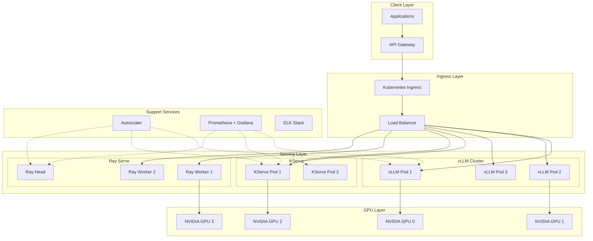

# Day 7 — AI Inference in Kubernetes

> **Production-Grade AI Inference Systems at Scale**

## 📋 Table of Contents

- [Overview](#overview)
- [Learning Objectives](#learning-objectives)
- [Inference Architecture Patterns](#inference-architecture-patterns)
- [vLLM Deployment](#vllm-deployment)
- [KServe Architecture](#kserve-architecture)
- [Ray Serve Clusters](#ray-serve-clusters)
- [GPU Allocation Strategies](#gpu-allocation-strategies)
- [Autoscaling Inference Workloads](#autoscaling-inference-workloads)
- [Load Balancing](#load-balancing)
- [High Availability](#high-availability)
- [Multi-Node Inference](#multi-node-inference)
- [Production Scaling Strategies](#production-scaling-strategies)
- [Best Practices](#best-practices)
- [Troubleshooting](#troubleshooting)

---

## Overview

Production AI inference requires robust, scalable infrastructure that can handle varying workloads while maintaining low latency and high throughput. Kubernetes provides the ideal platform for deploying and managing inference services with:

- **Automatic scaling** based on demand
- **GPU resource management** for optimal utilization
- **High availability** with failover capabilities
- **Load balancing** across multiple replicas
- **Observability** for performance monitoring

### Why Kubernetes for AI Inference?

| Aspect | Benefit |
|--------|---------|
| **Resource Efficiency** | GPU sharing, bin packing, quota management |
| **Scalability** | Horizontal pod autoscaling, cluster autoscaling |
| **Reliability** | Self-healing, rolling updates, health checks |
| **Flexibility** | Multiple serving frameworks, custom operators |
| **Cost Optimization** | Spot instances, rightsizing, scheduled scaling |

---

## Learning Objectives

By the end of this module, you will:

- ✅ Deploy vLLM for high-throughput LLM serving
- ✅ Understand KServe architecture and deployment
- ✅ Set up Ray Serve clusters for distributed inference
- ✅ Implement GPU allocation strategies
- ✅ Configure autoscaling for inference workloads
- ✅ Design load balancing solutions
- ✅ Build highly available inference systems
- ✅ Scale inference across multiple nodes
- ✅ Optimize for production requirements

---

## Inference Architecture Patterns

### Reference Architecture



### Serving Framework Comparison

| Framework | Best For | Throughput | Latency | GPU Support | Ease of Use |
|-----------|----------|------------|---------|-------------|-------------|
| **vLLM** | LLM serving | ⭐⭐⭐⭐⭐ | ⭐⭐⭐⭐ | Excellent | Easy |
| **KServe** | Multi-framework | ⭐⭐⭐⭐ | ⭐⭐⭐⭐ | Excellent | Medium |
| **Ray Serve** | Custom pipelines | ⭐⭐⭐⭐ | ⭐⭐⭐ | Excellent | Medium |
| **Triton** | Multi-model | ⭐⭐⭐⭐⭐ | ⭐⭐⭐⭐⭐ | Excellent | Complex |
| **TorchServe** | PyTorch models | ⭐⭐⭐ | ⭐⭐⭐ | Good | Easy |

---

## vLLM Deployment

### What is vLLM?

vLLM is a **high-throughput LLM serving engine** featuring:
- PagedAttention for efficient memory management
- Continuous batching for better GPU utilization
- 24x higher throughput than naive implementations
- Support for popular models (Llama, Mistral, etc.)

### Docker Deployment

```yaml
# docker-compose-vllm.yaml
version: '3.8'

services:
  vllm-server:
    image: vllm/vllm-openai:latest
    runtime: nvidia
    deploy:
      resources:
        reservations:
          devices:
            - driver: nvidia
              count: 1
              capabilities: [gpu]
    environment:
      - HUGGING_FACE_HUB_TOKEN=${HF_TOKEN}
    volumes:
      - hf-cache:/root/.cache/huggingface
    ports:
      - "8000:8000"
    command: >
      --model meta-llama/Llama-2-7b-chat-hf
      --tensor-parallel-size 1
      --max-num-seqs 256
      --gpu-memory-utilization 0.9
      --dtype auto
      --quantization awq

volumes:
  hf-cache:
```

### Kubernetes Deployment

```yaml
# vllm-deployment.yaml
apiVersion: apps/v1
kind: Deployment
metadata:
  name: vllm-inference
  namespace: ai-inference
spec:
  replicas: 3
  selector:
    matchLabels:
      app: vllm
  template:
    metadata:
      labels:
        app: vllm
      annotations:
        prometheus.io/scrape: "true"
        prometheus.io/port: "8000"
    spec:
      nodeSelector:
        gpu-type: nvidia-a10g
      tolerations:
        - key: nvidia.com/gpu
          operator: Exists
          effect: NoSchedule
      containers:
        - name: vllm
          image: vllm/vllm-openai:latest
          ports:
            - containerPort: 8000
              name: http
          env:
            - name: HUGGING_FACE_HUB_TOKEN
              valueFrom:
                secretKeyRef:
                  name: hf-secret
                  key: token
          resources:
            limits:
              nvidia.com/gpu: 1
              memory: 24Gi
            requests:
              nvidia.com/gpu: 1
              memory: 20Gi
          args:
            - "--model"
            - "meta-llama/Llama-2-7b-chat-hf"
            - "--tensor-parallel-size"
            - "1"
            - "--max-num-seqs"
            - "256"
            - "--gpu-memory-utilization"
            - "0.9"
            - "--enable-monitoring"
          livenessProbe:
            httpGet:
              path: /health
              port: 8000
            initialDelaySeconds: 30
            periodSeconds: 10
          readinessProbe:
            httpGet:
              path: /ready
              port: 8000
            initialDelaySeconds: 10
            periodSeconds: 5
---
apiVersion: v1
kind: Service
metadata:
  name: vllm-service
  namespace: ai-inference
spec:
  selector:
    app: vllm
  ports:
    - port: 80
      targetPort: 8000
      protocol: TCP
  type: ClusterIP
---
apiVersion: autoscaling/v2
kind: HorizontalPodAutoscaler
metadata:
  name: vllm-hpa
  namespace: ai-inference
spec:
  scaleTargetRef:
    apiVersion: apps/v1
    kind: Deployment
    name: vllm-inference
  minReplicas: 2
  maxReplicas: 10
  metrics:
    - type: Resource
      resource:
        name: cpu
        target:
          type: Utilization
          averageUtilization: 70
    - type: Pods
      pods:
        metric:
          name: requests_per_second
        target:
          type: AverageValue
          averageValue: "100"
```

### vLLM Performance Tuning

```python
# vllm-config.yaml
model:
  name: "meta-llama/Llama-2-70b-chat-hf"
  
# Tensor parallelism for multi-GPU
tensor_parallel_size: 4  # Number of GPUs per model instance

# Memory optimization
gpu_memory_utilization: 0.9  # 90% of GPU memory for KV cache
max_num_batched_tokens: 8192
max_num_seqs: 256

# Quantization options
quantization: "awq"  # or "gptq", "squeezellm"

# Batching strategy
enable_chunked_prefill: true
max_model_len: 4096

# Performance monitoring
enable_monitoring: true
disable_log_stats: false
```

---

## KServe Architecture

### What is KServe?

KServe is a **Kubernetes-native model serving platform** that provides:
- Standardized ML inference interfaces
- Auto-scaling including scale-to-zero
- Canary deployments and traffic splitting
- Multi-framework support (TensorFlow, PyTorch, ONNX, etc.)

### KServe Installation

```bash
# Install KServe with Istio
kubectl apply -f https://github.com/kserve/kserve/releases/download/v0.11.1/kserve.yaml

# Install additional components
kubectl apply -f https://github.com/kserve/kserve/releases/download/v0.11.1/kserve-cluster-resources.yaml

# Verify installation
kubectl get pods -n kserve
kubectl get svc -n kserve
```

### InferenceService Definition

```yaml
# llm-inferenceservice.yaml
apiVersion: serving.kserve.io/v1beta1
kind: InferenceService
metadata:
  name: llama-2-inference
  namespace: ai-inference
  annotations:
    serving.kserve.io/deploymentTimeout: "300"
    autoscaling.knative.dev/target: "10"
    autoscaling.knative.dev/minScale: "2"
    autoscaling.knative.dev/maxScale: "20"
spec:
  predictor:
    minReplicas: 2
    maxReplicas: 20
    scaleMetric: concurrency
    scaleTarget: 10
    timeout: 60
    workerSpec:
      numWorkers: 2
    model:
      modelFormat:
        name: vllm
      storageUri: hf://meta-llama/Llama-2-7b-chat-hf
      resources:
        limits:
          nvidia.com/gpu: 1
          memory: 24Gi
        requests:
          nvidia.com/gpu: 1
          memory: 20Gi
      env:
        - name: HUGGING_FACE_HUB_TOKEN
          valueFrom:
            secretKeyRef:
              name: hf-secret
              key: token
---
apiVersion: v1
kind: Secret
metadata:
  name: hf-secret
  namespace: ai-inference
type: Opaque
stringData:
  token: ${HF_TOKEN}
```

### Traffic Splitting (Canary Deployment)

```yaml
# canary-deployment.yaml
apiVersion: serving.kserve.io/v1beta1
kind: InferenceService
metadata:
  name: llm-canary
  namespace: ai-inference
spec:
  predictor:
    traffic:
      - configurationName: llm-v1
        percent: 90
      - configurationName: llm-v2
        percent: 10
    models:
      - name: llm-v1
        modelFormat:
          name: vllm
        storageUri: hf://meta-llama/Llama-2-7b-chat-hf
        resources:
          limits:
            nvidia.com/gpu: 1
      - name: llm-v2
        modelFormat:
          name: vllm
        storageUri: hf://mistralai/Mistral-7B-Instruct-v0.2
        resources:
          limits:
            nvidia.com/gpu: 1
```

### KServe Monitoring

```yaml
# kserve-metrics.yaml
apiVersion: monitoring.coreos.com/v1
kind: ServiceMonitor
metadata:
  name: kserve-monitor
  namespace: kserve
spec:
  selector:
    matchLabels:
      app: kserve
  endpoints:
    - port: http-metrics
      interval: 15s
      path: /metrics
```

---

## Ray Serve Clusters

### What is Ray Serve?

Ray Serve is a **scalable model serving library** built on Ray:
- Pythonic API for custom serving logic
- Automatic batching and replication
- Multi-model composition
- Integration with ML frameworks

### Ray Cluster on Kubernetes

```yaml
# ray-cluster.yaml
apiVersion: ray.io/v1
kind: RayCluster
metadata:
  name: inference-cluster
  namespace: ai-inference
spec:
  rayVersion: '2.9.0'
  headGroupSpec:
    rayStartParams:
      dashboard-host: '0.0.0.0'
      num-gpus: '0'
    template:
      spec:
        containers:
          - name: ray-head
            image: rayproject/ray:2.9.0-gpu
            ports:
              - containerPort: 6379
                name: gcs
              - containerPort: 8265
                name: dashboard
              - containerPort: 10001
                name: client
            resources:
              limits:
                cpu: 4
                memory: 16Gi
              requests:
                cpu: 2
                memory: 8Gi
  workerGroupSpecs:
    - groupName: gpu-workers
      replicas: 4
      minReplicas: 2
      maxReplicas: 10
      rayStartParams:
        num-gpus: '1'
      template:
        spec:
          nodeSelector:
            gpu-type: nvidia-a10g
          tolerations:
            - key: nvidia.com/gpu
              operator: Exists
              effect: NoSchedule
          containers:
            - name: ray-worker
              image: rayproject/ray:2.9.0-gpu
              resources:
                limits:
                  cpu: 8
                  memory: 32Gi
                  nvidia.com/gpu: 1
                requests:
                  cpu: 4
                  memory: 16Gi
                  nvidia.com/gpu: 1
```

### Ray Serve Deployment Script

```python
# serve_deployment.py
from ray import serve
from ray.serve import Application
import torch
from transformers import AutoModelForCausalLM, AutoTokenizer

@serve.deployment(
    num_replicas=4,
    ray_actor_options={"num_gpus": 1}
)
class LLMDeployment:
    def __init__(self, model_name: str):
        self.tokenizer = AutoTokenizer.from_pretrained(model_name)
        self.model = AutoModelForCausalLM.from_pretrained(
            model_name,
            device_map="auto",
            torch_dtype=torch.float16
        )
    
    async def __call__(self, request: dict) -> dict:
        prompt = request.get("prompt", "")
        max_tokens = request.get("max_tokens", 100)
        
        inputs = self.tokenizer(prompt, return_tensors="pt").to(self.model.device)
        outputs = self.model.generate(
            **inputs,
            max_new_tokens=max_tokens,
            do_sample=True,
            temperature=0.7
        )
        
        response = self.tokenizer.decode(outputs[0], skip_special_tokens=True)
        return {"response": response}

# Deploy application
app = LLMDeployment.bind("meta-llama/Llama-2-7b-chat-hf")

# Serve.run(app, host="0.0.0.0", port=8000)
```

### Ray Serve Config

```yaml
# serve_config.yaml
applications:
  - name: llm-app
    route_prefix: /generate
    import_path: serve_deployment:app
    runtime_env:
      working_dir: "."
      pip:
        - torch
        - transformers
        - accelerate
    deployments:
      - name: LLMDeployment
        num_replicas: 4
        user_config:
          model_name: "meta-llama/Llama-2-7b-chat-hf"
        ray_actor_options:
          num_gpus: 1
```

Deploy with:
```bash
serve deploy serve_config.yaml
```

---

## GPU Allocation Strategies

### GPU Sharing with MIG

```yaml
# mig-parted-config.yaml
# NVIDIA Multi-Instance GPU configuration
apiVersion: v1
kind: ConfigMap
metadata:
  name: mig-parted-config
  namespace: gpu-operator
data:
  config.yaml: |
    version: v1
    mig-configs:
      all-disabled:
        - device-filter: []
      all-enabled:
        - device-filter: []
          mig-enabled: true
          mig-strategy: single
      mixed:
        - device-filter: ["0"]
          mig-enabled: true
          mig-strategy: single
          mig-mixed-mode: true
        - device-filter: ["1-3"]
          mig-enabled: false
```

### Time-Slicing Configuration

```yaml
# time-slicing-config.yaml
apiVersion: v1
kind: ConfigMap
metadata:
  name: time-slicing-config
  namespace: gpu-operator
data:
  config.yaml: |
    version: v1
    sharing:
      timeSlicing:
        resources:
          - name: nvidia.com/gpu
            replicas: 4  # Share each GPU among 4 pods
```

### GPU Quota Management

```yaml
# resource-quota.yaml
apiVersion: v1
kind: ResourceQuota
metadata:
  name: gpu-quota
  namespace: ai-inference
spec:
  hard:
    requests.cpu: "100"
    requests.memory: 200Gi
    limits.cpu: "200"
    limits.memory: 400Gi
    nvidia.com/gpu: "16"
    pods: "50"
---
apiVersion: v1
kind: LimitRange
metadata:
  name: gpu-limits
  namespace: ai-inference
spec:
  limits:
    - type: Container
      default:
        nvidia.com/gpu: "1"
        memory: 16Gi
      defaultRequest:
        nvidia.com/gpu: "1"
        memory: 8Gi
```

### GPU Scheduling Priority

```yaml
# priority-class.yaml
apiVersion: scheduling.k8s.io/v1
kind: PriorityClass
metadata:
  name: inference-high-priority
value: 1000000
globalDefault: false
description: "High priority for production inference workloads"
---
apiVersion: scheduling.k8s.io/v1
kind: PriorityClass
metadata:
  name: inference-low-priority
value: 100000
globalDefault: false
description: "Low priority for development/batch workloads"
```

---

## Autoscaling Inference Workloads

### Horizontal Pod Autoscaler (HPA)

```yaml
# hpa-custom-metrics.yaml
apiVersion: autoscaling/v2
kind: HorizontalPodAutoscaler
metadata:
  name: inference-hpa
  namespace: ai-inference
spec:
  scaleTargetRef:
    apiVersion: apps/v1
    kind: Deployment
    name: vllm-inference
  minReplicas: 2
  maxReplicas: 20
  behavior:
    scaleDown:
      stabilizationWindowSeconds: 300
      policies:
        - type: Percent
          value: 50
          periodSeconds: 60
    scaleUp:
      stabilizationWindowSeconds: 0
      policies:
        - type: Percent
          value: 100
          periodSeconds: 15
        - type: Pods
          value: 4
          periodSeconds: 15
      selectPolicy: Max
  metrics:
    - type: External
      external:
        metric:
          name: requests_per_second
          selector:
            matchLabels:
              service: vllm
        target:
          type: AverageValue
          averageValue: "100"
    - type: Resource
      resource:
        name: memory
        target:
          type: Utilization
          averageUtilization: 80
```

### KEDA for Event-Driven Autoscaling

```yaml
# keda-scaledobject.yaml
apiVersion: keda.sh/v1alpha1
kind: ScaledObject
metadata:
  name: inference-scaledobject
  namespace: ai-inference
spec:
  scaleTargetRef:
    name: vllm-inference
  minReplicaCount: 2
  maxReplicaCount: 50
  cooldownPeriod: 300
  pollingInterval: 15
  triggers:
    - type: prometheus
      metadata:
        serverAddress: http://prometheus:9090
        metricName: inference_requests_queue_depth
        threshold: '10'
        query: sum(queue_depth{service="vllm"})
    - type: cpu
      metadata:
        type: Utilization
        value: "70"
    - type: memory
      metadata:
        type: Utilization
        value: "80"
```

### Cluster Autoscaler Configuration

```yaml
# cluster-autoscaler-config.yaml
apiVersion: v1
kind: ConfigMap
metadata:
  name: cluster-autoscaler-config
  namespace: kube-system
data:
  config.yaml: |
    cloudProvider: aws
    expander: least-waste
    balanceSimilarNodeGroups: true
    skipNodesWithLocalStorage: false
    skipNodesWithSystemPods: true
    scaleDownEnabled: true
    scaleDownDelayAfterAdd: 5m
    scaleDownUnneededTime: 10m
    scaleDownUtilizationThreshold: 0.5
    maxNodeProvisionTime: 15m
    nodeAutodiscovery:
      enabled: true
      filters:
        - tag:kubernetes.io/cluster-name=<cluster-name>
```

---

## Load Balancing

### NGINX Ingress with Rate Limiting

```yaml
# ingress-loadbalancer.yaml
apiVersion: networking.k8s.io/v1
kind: Ingress
metadata:
  name: inference-ingress
  namespace: ai-inference
  annotations:
    nginx.ingress.kubernetes.io/rate-limit: "100"
    nginx.ingress.kubernetes.io/rate-limit-window: "1m"
    nginx.ingress.kubernetes.io/load-balance: "round_robin"
    nginx.ingress.kubernetes.io/upstream-hash-by: "$binary_remote_addr"
    nginx.ingress.kubernetes.io/proxy-connect-timeout: "30"
    nginx.ingress.kubernetes.io/proxy-read-timeout: "120"
    nginx.ingress.kubernetes.io/proxy-send-timeout: "120"
    nginx.ingress.kubernetes.io/proxy-body-size: "10m"
spec:
  ingressClassName: nginx
  tls:
    - hosts:
        - inference.example.com
      secretName: inference-tls-secret
  rules:
    - host: inference.example.com
      http:
        paths:
          - path: /v1/completions
            pathType: Prefix
            backend:
              service:
                name: vllm-service
                port:
                  number: 80
          - path: /v1/chat/completions
            pathType: Prefix
            backend:
              service:
                name: vllm-service
                port:
                  number: 80
```

### Service Mesh with Istio

```yaml
# istio-destination-rule.yaml
apiVersion: networking.istio.io/v1beta1
kind: DestinationRule
metadata:
  name: vllm-destination
  namespace: ai-inference
spec:
  host: vllm-service.ai-inference.svc.cluster.local
  trafficPolicy:
    connectionPool:
      tcp:
        maxConnections: 100
      http:
        h2UpgradePolicy: UPGRADE
        http1MaxPendingRequests: 100
        http2MaxRequests: 1000
        maxRequestsPerConnection: 100
    outlierDetection:
      consecutive5xxErrors: 5
      interval: 30s
      baseEjectionTime: 30s
      maxEjectionPercent: 50
    loadBalancer:
      simple: LEAST_CONN
---
apiVersion: networking.istio.io/v1beta1
kind: VirtualService
metadata:
  name: vllm-virtualservice
  namespace: ai-inference
spec:
  hosts:
    - vllm-service.ai-inference.svc.cluster.local
  http:
    - route:
        - destination:
            host: vllm-service.ai-inference.svc.cluster.local
            port:
              number: 80
      timeout: 120s
      retries:
        attempts: 3
        perTryTimeout: 30s
        retryOn: 5xx,reset,connect-failure
```

---

## High Availability

### Multi-Zone Deployment

```yaml
# multi-zone-deployment.yaml
apiVersion: apps/v1
kind: Deployment
metadata:
  name: vllm-ha
  namespace: ai-inference
spec:
  replicas: 9
  strategy:
    type: RollingUpdate
    rollingUpdate:
      maxSurge: 1
      maxUnavailable: 0
  template:
    spec:
      topologySpreadConstraints:
        - maxSkew: 1
          topologyKey: topology.kubernetes.io/zone
          whenUnsatisfiable: DoNotSchedule
          labelSelector:
            matchLabels:
              app: vllm
        - maxSkew: 1
          topologyKey: kubernetes.io/hostname
          whenUnsatisfiable: ScheduleAnyway
          labelSelector:
            matchLabels:
              app: vllm
      affinity:
        podAntiAffinity:
          preferredDuringSchedulingIgnoredDuringExecution:
            - weight: 100
              podAffinityTerm:
                labelSelector:
                  matchLabels:
                    app: vllm
                topologyKey: kubernetes.io/hostname
```

### Pod Disruption Budget

```yaml
# pdb.yaml
apiVersion: policy/v1
kind: PodDisruptionBudget
metadata:
  name: vllm-pdb
  namespace: ai-inference
spec:
  minAvailable: 2
  selector:
    matchLabels:
      app: vllm
---
apiVersion: policy/v1
kind: PodDisruptionBudget
metadata:
  name: kserve-pdb
  namespace: ai-inference
spec:
  maxUnavailable: 1
  selector:
    matchLabels:
      serving.kserve.io/inferenceservice: llama-2-inference
```

### Health Checks and Probes

```yaml
# health-probes.yaml
containers:
  - name: vllm
    livenessProbe:
      httpGet:
        path: /health
        port: 8000
      initialDelaySeconds: 30
      periodSeconds: 10
      timeoutSeconds: 5
      failureThreshold: 3
    readinessProbe:
      httpGet:
        path: /ready
        port: 8000
      initialDelaySeconds: 10
      periodSeconds: 5
      timeoutSeconds: 3
      failureThreshold: 3
    startupProbe:
      httpGet:
        path: /health
        port: 8000
      initialDelaySeconds: 0
      periodSeconds: 5
      timeoutSeconds: 5
      failureThreshold: 60  # Allow up to 5 minutes for startup
```

---

## Multi-Node Inference

### Tensor Parallelism

```yaml
# tensor-parallel-deployment.yaml
apiVersion: apps/v1
kind: Deployment
metadata:
  name: vllm-tp
  namespace: ai-inference
spec:
  replicas: 2  # 2 model instances
  template:
    spec:
      containers:
        - name: vllm
          args:
            - "--model"
            - "meta-llama/Llama-2-70b-chat-hf"
            - "--tensor-parallel-size"
            - "4"  # Each instance uses 4 GPUs
          resources:
            limits:
              nvidia.com/gpu: "4"
              memory: 96Gi
```

### Pipeline Parallelism

```python
# pipeline_parallel_config.py
from ray import serve

@serve.deployment(num_replicas=1)
class FirstStage:
    def __init__(self):
        # Load first layers of model
        pass
    
    async def __call__(self, inputs):
        # Process first stage
        return intermediate_output

@serve.deployment(num_replicas=1)
class SecondStage:
    def __init__(self):
        # Load middle layers
        pass
    
    async def __call__(self, inputs):
        # Process second stage
        return intermediate_output

@serve.deployment(num_replicas=1)
class FinalStage:
    def __init__(self):
        # Load final layers
        pass
    
    async def __call__(self, inputs):
        # Generate output
        return output

# Compose pipeline
pipeline_app = FirstStage.bind() >> SecondStage.bind() >> FinalStage.bind()
```

---

## Production Scaling Strategies

### Scaling Playbook

| Scenario | Strategy | Action |
|----------|----------|--------|
| **Traffic Spike** | Horizontal Scaling | Increase replicas via HPA |
| **GPU Exhaustion** | Vertical Scaling | Add more GPU nodes |
| **Memory Pressure** | Model Optimization | Enable quantization, reduce batch size |
| **High Latency** | Load Distribution | Add regions, enable caching |
| **Cost Concerns** | Right-sizing | Use spot instances, schedule scaling |

### Cost Optimization

```yaml
# cost-optimized-hpa.yaml
apiVersion: autoscaling/v2
kind: HorizontalPodAutoscaler
metadata:
  name: cost-optimized-hpa
spec:
  scaleTargetRef:
    apiVersion: apps/v1
    kind: Deployment
    name: vllm-inference
  minReplicas: 2
  maxReplicas: 10
  metrics:
    - type: External
      external:
        metric:
          name: cost_per_request
        target:
          type: Value
          value: "0.001"  # Target $0.001 per request
  behavior:
    scaleDown:
      stabilizationWindowSeconds: 600  # Wait 10 min before scaling down
```

### Scheduled Scaling

```yaml
# cronjob-scaling.yaml
apiVersion: batch/v1
kind: CronJob
metadata:
  name: scale-down-night
spec:
  schedule: "0 22 * * *"  # 10 PM daily
  jobTemplate:
    spec:
      template:
        spec:
          containers:
            - name: kubectl
              image: bitnami/kubectl:latest
              command:
                - /bin/sh
                - -c
                - |
                  kubectl scale deployment vllm-inference --replicas=2 -n ai-inference
          restartPolicy: OnFailure
---
apiVersion: batch/v1
kind: CronJob
metadata:
  name: scale-up-morning
spec:
  schedule: "0 8 * * *"  # 8 AM daily
  jobTemplate:
    spec:
      template:
        spec:
          containers:
            - name: kubectl
              image: bitnami/kubectl:latest
              command:
                - /bin/sh
                - -c
                - |
                  kubectl scale deployment vllm-inference --replicas=10 -n ai-inference
          restartPolicy: OnFailure
```

---

## Best Practices

### ✅ DO

1. **Use vLLM for LLMs**: Best throughput for large language models
2. **Enable Quantization**: AWQ/GPTQ for 4x memory reduction
3. **Implement Circuit Breakers**: Prevent cascade failures
4. **Monitor GPU Metrics**: Track utilization, memory, temperature
5. **Use Pod Disruption Budgets**: Ensure minimum availability
6. **Enable Request Batching**: Improve GPU utilization
7. **Implement Caching**: Cache frequent responses
8. **Set Resource Limits**: Prevent resource starvation

### ❌ DON'T

1. **Don't Over-Provision**: Start small and scale based on metrics
2. **Don't Ignore Cold Starts**: Pre-warm instances for critical services
3. **Don't Skip Health Checks**: Essential for load balancing
4. **Don't Mix Workloads**: Separate inference from training
5. **Don't Forget Logging**: Capture all requests for debugging
6. **Don't Hardcode Replicas**: Use autoscaling

---

## Troubleshooting

| Issue | Symptoms | Solution |
|-------|----------|----------|
| **GPU OOM** | Pods crash with OOMKilled | Reduce batch size, enable quantization, increase GPU memory |
| **High Latency** | P99 > SLA | Check GPU utilization, enable continuous batching, add replicas |
| **Uneven Load** | Some pods idle | Review load balancer config, check session affinity |
| **Scaling Issues** | HPA not triggering | Verify metrics server, check custom metrics |
| **Cold Starts** | Slow initial response | Pre-warm pods, use minReplicas > 0 |
| **GPU Not Found** | Pod pending | Check node selectors, tolerations, GPU drivers |

### Debug Commands

```bash
# Check GPU allocation
kubectl describe node <node-name> | grep -A 5 "Allocated resources"

# Monitor GPU usage
kubectl top pods -n ai-inference

# Check vLLM metrics
curl http://<vllm-pod-ip>:8000/metrics

# View inference logs
kubectl logs -l app=vllm -n ai-inference --tail=100

# Test endpoint
curl -X POST http://<service-url>/v1/completions \
  -H "Content-Type: application/json" \
  -d '{"prompt": "Hello", "max_tokens": 100}'
```

---

## Conclusion

Production AI inference on Kubernetes requires careful attention to:
- **Framework selection** (vLLM, KServe, Ray Serve)
- **GPU optimization** (sharing, quantization, parallelism)
- **Autoscaling** (HPA, KEDA, cluster autoscaler)
- **High availability** (multi-zone, PDBs, health checks)
- **Monitoring** (metrics, logging, tracing)

Master these patterns to build reliable, scalable inference systems.

---

**📚 Additional Resources**

- [vLLM Documentation](https://docs.vllm.ai/)
- [KServe Documentation](https://kserve.github.io/website/)
- [Ray Serve Documentation](https://docs.ray.io/en/latest/serve/index.html)
- [NVIDIA GPU Operator](https://docs.nvidia.com/datacenter/cloud-native/gpu-operator/latest/)
- [KEDA Documentation](https://keda.sh/docs/)
