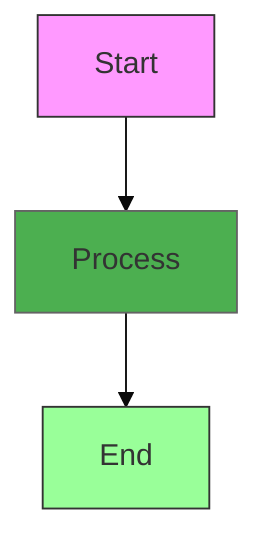

# 📊 Architecture Diagrams

This directory contains visual architecture diagrams for the DevOps AI Engineer Roadmap.

## Available Diagrams

### 1. DevOps AI Flowchart
**File:** `devops-ai-flowchart.mmd`

Shows the complete flow from local development to Kubernetes deployment with AI services integration.

**Preview:** Render with Mermaid-compatible viewers or GitHub Markdown.

**Key Components:**
- Developer workflow
- Local development environment
- Kubernetes cluster
- AI/ML services (Ollama, Vector DB, Monitoring)

### 2. RAG Architecture
**File:** `rag-architecture.mmd`

Detailed architecture of the Retrieval-Augmented Generation (RAG) system used in the Local RAG Assistant project.

**Preview:** Render with Mermaid-compatible viewers or GitHub Markdown.

**Key Components:**
- Streamlit Web UI
- Query processing and embedding
- Qdrant vector database
- Ollama LLM inference

## How to Use

### View in GitHub
Simply open this directory on GitHub - Mermaid diagrams render automatically!

### Render Locally

Using Mermaid CLI:
```bash
# Install mermaid-cli
npm install -g @mermaid-js/mermaid-cli

# Convert to PNG
mmdc -i diagrams/devops-ai-flowchart.mmd -o diagrams/devops-ai-flowchart.png

# Convert to SVG
mmdc -i diagrams/rag-architecture.mmd -o diagrams/rag-architecture.svg
```

### Edit Diagrams

1. **Online Editor:** [Mermaid Live Editor](https://mermaid.live/)
   - Copy diagram content
   - Edit visually
   - Export updated version

2. **VS Code Extension:** 
   - Install "Markdown Preview Mermaid Support"
   - Edit `.mmd` files with live preview

3. **Draw.io Alternative:**
   - Import Mermaid code
   - Use drag-and-drop editor
   - Export as PNG/SVG/PDF

## Create Your Own Diagram

Template for new diagrams:



### Diagram Types Supported

- **Flowchart:** Process flows and workflows
- **Sequence:** Interaction sequences
- **Class:** Object-oriented class diagrams
- **State:** State machines
- **Entity Relationship:** Database schemas
- **User Journey:** User experience flows
- **Gantt:** Project timelines
- **Pie:** Proportional data

## Best Practices

1. **Keep it Simple:** Don't overcrowd diagrams
2. **Use Consistent Colors:** Follow the color scheme
3. **Add Labels:** Make connections clear
4. **Version Control:** Commit both `.mmd` and exported `.png/.svg`
5. **Document:** Explain complex diagrams in README

## Color Scheme

Follow the repository's color conventions:

- 🔵 Blue (`#e3f2fd`): User/Client components
- 🟠 Orange (`#fff3e0`): Application layer
- 🟢 Green (`#e8f5e9`): Infrastructure/Storage
- 🟣 Purple (`#f3e5f5`): AI/ML services
- 🔴 Red (`#ffebee`): Alerts/Errors
- 🟡 Yellow (`#fffde7`): Warnings/Queues

## Tools & Resources

- [Mermaid Documentation](https://mermaid.js.org/)
- [Mermaid Live Editor](https://mermaid.live/)
- [Draw.io](https://app.diagrams.net/) - Alternative graphical tool
- [Excalidraw](https://excalidraw.com/) - Hand-drawn style diagrams
- [PlantUML](https://plantuml.com/) - Alternative text-based tool

## Contributing

When adding new diagrams:

1. Create `.mmd` file with Mermaid syntax
2. Export as both `.png` and `.svg`
3. Add entry to this README
4. Reference in relevant documentation
5. Update table of contents

---

**Need Help?** Check the Mermaid documentation or ask in GitHub Discussions!
